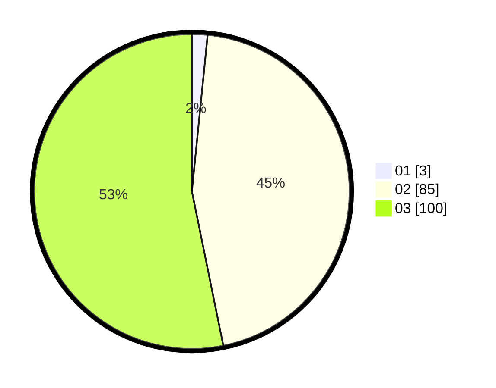

# Hasil

Hasil perolehan suara paslon dapat dilihat pada file paslon-01.txt, paslon-02.txt, dan paslon-03.txt.

Jika tidak ada, artinya data tersebut belum ada pada SIREKAP.

## Perolehan Suara

 * Paslon 01: **3**.
 * Paslon 02: **85**.
 * Paslon 03: **100**.

## Foto C Plano

https://sirekap-obj-formc.kpu.go.id/1b3c/pemilu/ppwp/31/73/05/10/05/3173051005187-20240214-222753--dcbe1ca9-a1de-43bc-a426-94a9e3735760.jpg

https://sirekap-obj-formc.kpu.go.id/1b3c/pemilu/ppwp/31/73/05/10/05/3173051005187-20240214-222928--c2a4ce6d-f3fb-44b8-99ac-02d771d679db.jpg

https://sirekap-obj-formc.kpu.go.id/1b3c/pemilu/ppwp/31/73/05/10/05/3173051005187-20240214-223021--37e444f4-7eeb-42e6-9ee4-07f20d9ec1b3.jpg

## DATA PEMILIH TETAP

Jumlah pemilih dalam DPT: **282**.
 * L: **131**.
 * P: **151**.

## DATA PENGGUNA HAK PILIH

Jumlah pengguna hak pilih dalam DPT: **188**.
 * L: **91**.
 * P: **97**.

Jumlah pengguna hak pilih dalam DPTb: **1**.
 * L: **0**.
 * P: **1**.

Jumlah pengguna hak pilih dalam DPK: **0**.
 * L: **0**.
 * P: **0**.

Jumlah pengguna hak pilih: **189**.
 * L: **91**.
 * P: **98**.

## JUMLAH SUARA SAH DAN TIDAK SAH

JUMLAH SELURUH SUARA SAH: **188**.

JUMLAH SUARA TIDAK SAH: **1**.

JUMLAH SELURUH SUARA SAH DAN SUARA TIDAK SAH: **189**.
