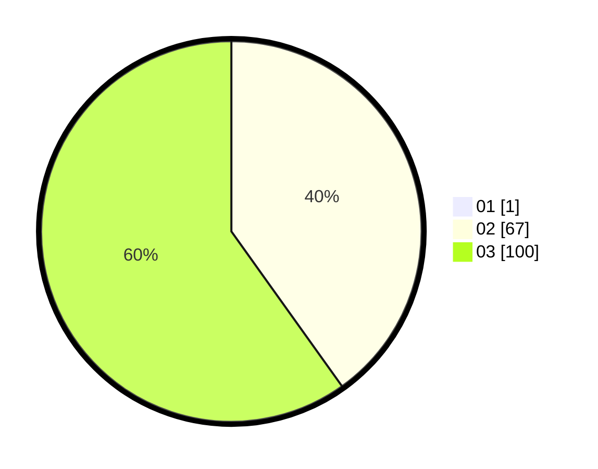

# Hasil

Hasil perolehan suara paslon dapat dilihat pada file paslon-01.txt, paslon-02.txt, dan paslon-03.txt.

Jika tidak ada, artinya data tersebut belum ada pada SIREKAP.

## Perolehan Suara

 * Paslon 01: **1**.
 * Paslon 02: **67**.
 * Paslon 03: **100**.

## Foto C Plano

https://sirekap-obj-formc.kpu.go.id/c414/pemilu/ppwp/31/73/05/10/05/3173051005190-20240214-184453--1846e18b-9734-4a16-a6d6-9118854b3744.jpg

https://sirekap-obj-formc.kpu.go.id/c414/pemilu/ppwp/31/73/05/10/05/3173051005190-20240214-184625--d094d2a0-3800-4310-99f6-e5d8e15810cf.jpg

https://sirekap-obj-formc.kpu.go.id/c414/pemilu/ppwp/31/73/05/10/05/3173051005190-20240214-184712--6acca12a-03df-47f0-b1cb-6db373e730e0.jpg

## DATA PEMILIH TETAP

Jumlah pemilih dalam DPT: **270**.
 * L: **128**.
 * P: **142**.

## DATA PENGGUNA HAK PILIH

Jumlah pengguna hak pilih dalam DPT: **164**.
 * L: **75**.
 * P: **89**.

Jumlah pengguna hak pilih dalam DPTb: **4**.
 * L: **0**.
 * P: **4**.

Jumlah pengguna hak pilih dalam DPK: **1**.
 * L: **1**.
 * P: **0**.

Jumlah pengguna hak pilih: **169**.
 * L: **76**.
 * P: **93**.

## JUMLAH SUARA SAH DAN TIDAK SAH

JUMLAH SELURUH SUARA SAH: **168**.

JUMLAH SUARA TIDAK SAH: **1**.

JUMLAH SELURUH SUARA SAH DAN SUARA TIDAK SAH: **169**.
