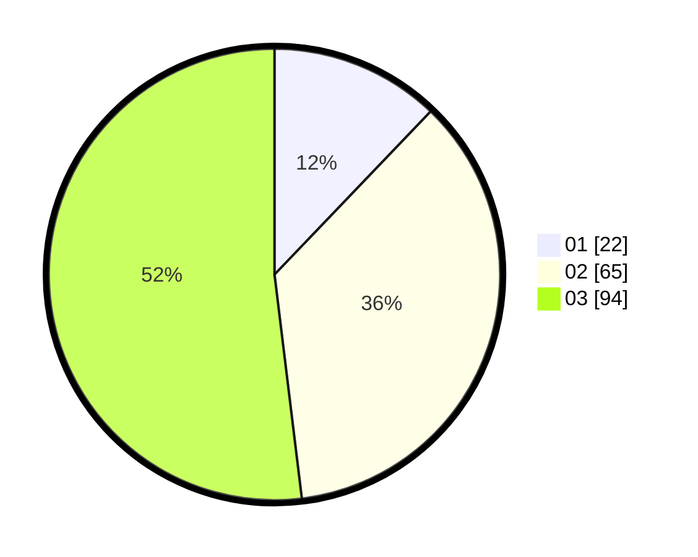

# Hasil

Hasil perolehan suara paslon dapat dilihat pada file paslon-01.txt, paslon-02.txt, dan paslon-03.txt.

Jika tidak ada, artinya data tersebut belum ada pada SIREKAP.

## Perolehan Suara

 * Paslon 01: **22**.
 * Paslon 02: **65**.
 * Paslon 03: **94**.

## Foto C Plano

https://sirekap-obj-formc.kpu.go.id/465d/pemilu/ppwp/31/73/05/10/05/3173051005192-20240214-191509--49a836cb-009f-49a4-ab99-4acfb85b692f.jpg

https://sirekap-obj-formc.kpu.go.id/465d/pemilu/ppwp/31/73/05/10/05/3173051005192-20240214-155428--3ac25d2a-c20d-4c3a-b9e0-8d3a5e24f29a.jpg

https://sirekap-obj-formc.kpu.go.id/465d/pemilu/ppwp/31/73/05/10/05/3173051005192-20240214-155455--d5e236c1-831c-4eb0-9f83-45d663ff5ec8.jpg

## DATA PEMILIH TETAP

Jumlah pemilih dalam DPT: **267**.
 * L: **123**.
 * P: **144**.

## DATA PENGGUNA HAK PILIH

Jumlah pengguna hak pilih dalam DPT: **181**.
 * L: **79**.
 * P: **102**.

Jumlah pengguna hak pilih dalam DPTb: **0**.
 * L: **0**.
 * P: **0**.

Jumlah pengguna hak pilih dalam DPK: **0**.
 * L: **0**.
 * P: **0**.

Jumlah pengguna hak pilih: **181**.
 * L: **79**.
 * P: **102**.

## JUMLAH SUARA SAH DAN TIDAK SAH

JUMLAH SELURUH SUARA SAH: **181**.

JUMLAH SUARA TIDAK SAH: **0**.

JUMLAH SELURUH SUARA SAH DAN SUARA TIDAK SAH: **181**.
