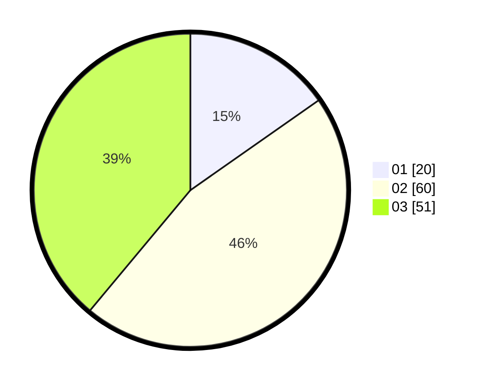

# Hasil

Hasil perolehan suara paslon dapat dilihat pada file paslon-01.txt, paslon-02.txt, dan paslon-03.txt.

Jika tidak ada, artinya data tersebut belum ada pada SIREKAP.

## Perolehan Suara

 * Paslon 01: **20**.
 * Paslon 02: **60**.
 * Paslon 03: **51**.

## Foto C Plano

https://sirekap-obj-formc.kpu.go.id/3f9f/pemilu/ppwp/31/73/05/10/05/3173051005193-20240214-155147--0b56e2b3-f48a-40d1-bc7c-55f434756bd7.jpg

https://sirekap-obj-formc.kpu.go.id/3f9f/pemilu/ppwp/31/73/05/10/05/3173051005193-20240214-195857--9d3306e7-7ed6-4aa2-ab46-7421a2a2d7ab.jpg

https://sirekap-obj-formc.kpu.go.id/3f9f/pemilu/ppwp/31/73/05/10/05/3173051005193-20240214-155635--13392452-26b1-4f1f-81b9-c089f687c4cc.jpg

## DATA PEMILIH TETAP

Jumlah pemilih dalam DPT: **220**.
 * L: **102**.
 * P: **128**.

## DATA PENGGUNA HAK PILIH

Jumlah pengguna hak pilih dalam DPT: **131**.
 * L: **58**.
 * P: **73**.

Jumlah pengguna hak pilih dalam DPTb: **2**.
 * L: **1**.
 * P: **1**.

Jumlah pengguna hak pilih dalam DPK: **0**.
 * L: **0**.
 * P: **0**.

Jumlah pengguna hak pilih: **133**.
 * L: **59**.
 * P: **74**.

## JUMLAH SUARA SAH DAN TIDAK SAH

JUMLAH SELURUH SUARA SAH: **131**.

JUMLAH SUARA TIDAK SAH: **2**.

JUMLAH SELURUH SUARA SAH DAN SUARA TIDAK SAH: **133**.
