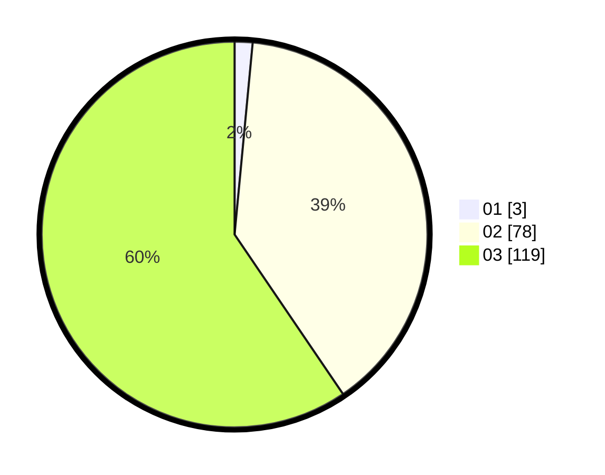

# Hasil

Hasil perolehan suara paslon dapat dilihat pada file paslon-01.txt, paslon-02.txt, dan paslon-03.txt.

Jika tidak ada, artinya data tersebut belum ada pada SIREKAP.

## Perolehan Suara

 * Paslon 01: **3**.
 * Paslon 02: **78**.
 * Paslon 03: **119**.

## Foto C Plano

https://sirekap-obj-formc.kpu.go.id/b71c/pemilu/ppwp/31/73/05/10/05/3173051005197-20240214-221326--49c97977-0bd6-4f60-b0f4-9798f1c3cc39.jpg

https://sirekap-obj-formc.kpu.go.id/b71c/pemilu/ppwp/31/73/05/10/05/3173051005197-20240214-221400--43519481-1ddc-4686-bf9b-f06a0d673f66.jpg

https://sirekap-obj-formc.kpu.go.id/b71c/pemilu/ppwp/31/73/05/10/05/3173051005197-20240214-221422--02a86898-6724-42bd-bf65-57e606a90cec.jpg

## DATA PEMILIH TETAP

Jumlah pemilih dalam DPT: **285**.
 * L: **138**.
 * P: **147**.

## DATA PENGGUNA HAK PILIH

Jumlah pengguna hak pilih dalam DPT: **194**.
 * L: **98**.
 * P: **96**.

Jumlah pengguna hak pilih dalam DPTb: **5**.
 * L: **4**.
 * P: **1**.

Jumlah pengguna hak pilih dalam DPK: **3**.
 * L: **2**.
 * P: **1**.

Jumlah pengguna hak pilih: **202**.
 * L: **104**.
 * P: **98**.

## JUMLAH SUARA SAH DAN TIDAK SAH

JUMLAH SELURUH SUARA SAH: **200**.

JUMLAH SUARA TIDAK SAH: **3**.

JUMLAH SELURUH SUARA SAH DAN SUARA TIDAK SAH: **202**.
