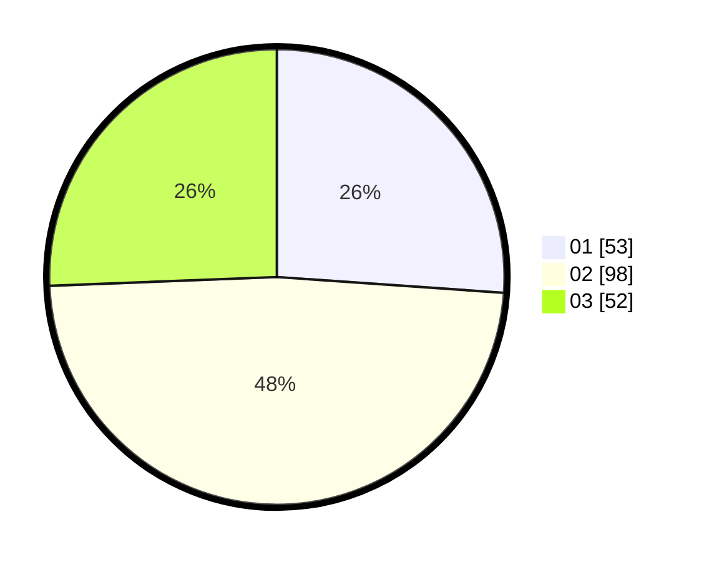

# Hasil

Hasil perolehan suara paslon dapat dilihat pada file paslon-01.txt, paslon-02.txt, dan paslon-03.txt.

Jika tidak ada, artinya data tersebut belum ada pada SIREKAP.

## Perolehan Suara

 * Paslon 01: **53**.
 * Paslon 02: **98**.
 * Paslon 03: **52**.

## Foto C Plano

https://sirekap-obj-formc.kpu.go.id/e76b/pemilu/ppwp/31/73/05/10/06/3173051006001-20240218-131955--2fa7851d-ee22-4def-b03b-f4d89ba1d963.jpg

https://sirekap-obj-formc.kpu.go.id/e76b/pemilu/ppwp/31/73/05/10/06/3173051006001-20240218-131957--3876740a-aa83-4c3c-bcce-8a11a24170d9.jpg

https://sirekap-obj-formc.kpu.go.id/e76b/pemilu/ppwp/31/73/05/10/06/3173051006001-20240218-131956--fb0e796b-5fc3-4e80-a840-d88b94a81e68.jpg

## DATA PEMILIH TETAP

Jumlah pemilih dalam DPT: **0**.
 * L: **0**.
 * P: **0**.

## DATA PENGGUNA HAK PILIH

Jumlah pengguna hak pilih dalam DPT: **0**.
 * L: **0**.
 * P: **0**.

Jumlah pengguna hak pilih dalam DPTb: **0**.
 * L: **0**.
 * P: **0**.

Jumlah pengguna hak pilih dalam DPK: **0**.
 * L: **0**.
 * P: **0**.

Jumlah pengguna hak pilih: **0**.
 * L: **0**.
 * P: **0**.

## JUMLAH SUARA SAH DAN TIDAK SAH

JUMLAH SELURUH SUARA SAH: **203**.

JUMLAH SUARA TIDAK SAH: **10**.

JUMLAH SELURUH SUARA SAH DAN SUARA TIDAK SAH: **213**.
