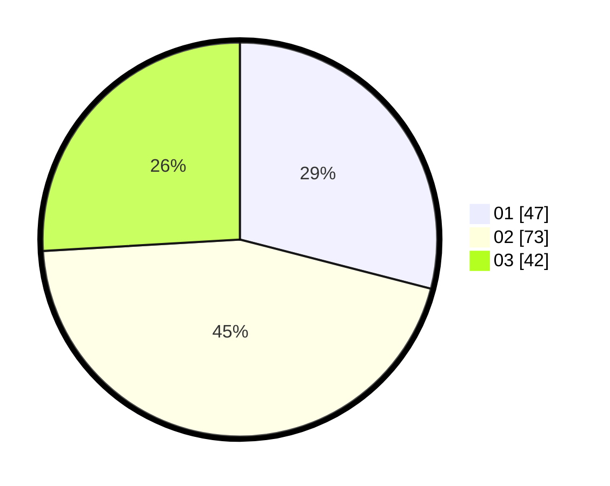

# Hasil

Hasil perolehan suara paslon dapat dilihat pada file paslon-01.txt, paslon-02.txt, dan paslon-03.txt.

Jika tidak ada, artinya data tersebut belum ada pada SIREKAP.

## Perolehan Suara

 * Paslon 01: **47**.
 * Paslon 02: **73**.
 * Paslon 03: **42**.

## Foto C Plano

https://sirekap-obj-formc.kpu.go.id/0ec8/pemilu/ppwp/31/73/05/10/06/3173051006002-20240216-140418--99ffea01-3306-4da6-9bea-0d7502752945.jpg

https://sirekap-obj-formc.kpu.go.id/0ec8/pemilu/ppwp/31/73/05/10/06/3173051006002-20240216-140420--743345e9-8ed9-4579-adee-ad65b3d607ad.jpg

https://sirekap-obj-formc.kpu.go.id/0ec8/pemilu/ppwp/31/73/05/10/06/3173051006002-20240216-140419--6d79b8c2-cc90-4523-8c9f-38331c434396.jpg

## DATA PEMILIH TETAP

Jumlah pemilih dalam DPT: **249**.
 * L: **111**.
 * P: **138**.

## DATA PENGGUNA HAK PILIH

Jumlah pengguna hak pilih dalam DPT: **161**.
 * L: **69**.
 * P: **92**.

Jumlah pengguna hak pilih dalam DPTb: **2**.
 * L: **1**.
 * P: **1**.

Jumlah pengguna hak pilih dalam DPK: **1**.
 * L: **0**.
 * P: **1**.

Jumlah pengguna hak pilih: **164**.
 * L: **70**.
 * P: **94**.

## JUMLAH SUARA SAH DAN TIDAK SAH

JUMLAH SELURUH SUARA SAH: **162**.

JUMLAH SUARA TIDAK SAH: **2**.

JUMLAH SELURUH SUARA SAH DAN SUARA TIDAK SAH: **164**.
