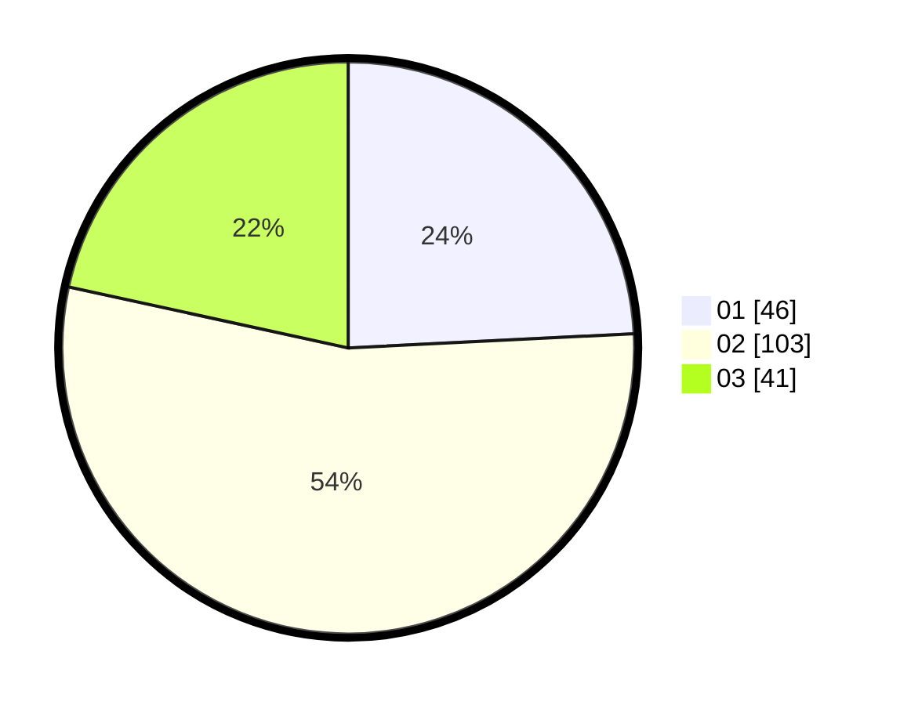

# Hasil

Hasil perolehan suara paslon dapat dilihat pada file paslon-01.txt, paslon-02.txt, dan paslon-03.txt.

Jika tidak ada, artinya data tersebut belum ada pada SIREKAP.

## Perolehan Suara

 * Paslon 01: **46**.
 * Paslon 02: **103**.
 * Paslon 03: **41**.

## Foto C Plano

https://sirekap-obj-formc.kpu.go.id/6157/pemilu/ppwp/31/73/05/10/06/3173051006003-20240216-140737--536a9519-781a-4f31-8436-88f6b6f46fe8.jpg

https://sirekap-obj-formc.kpu.go.id/6157/pemilu/ppwp/31/73/05/10/06/3173051006003-20240216-140738--e08b23c0-8010-4e96-982f-56d36c05152e.jpg

https://sirekap-obj-formc.kpu.go.id/6157/pemilu/ppwp/31/73/05/10/06/3173051006003-20240216-140737--3fe4f714-04bc-443c-bea2-31285e690333.jpg

## DATA PEMILIH TETAP

Jumlah pemilih dalam DPT: **246**.
 * L: **126**.
 * P: **120**.

## DATA PENGGUNA HAK PILIH

Jumlah pengguna hak pilih dalam DPT: **181**.
 * L: **91**.
 * P: **90**.

Jumlah pengguna hak pilih dalam DPTb: **5**.
 * L: **1**.
 * P: **4**.

Jumlah pengguna hak pilih dalam DPK: **8**.
 * L: **4**.
 * P: **4**.

Jumlah pengguna hak pilih: **194**.
 * L: **96**.
 * P: **98**.

## JUMLAH SUARA SAH DAN TIDAK SAH

JUMLAH SELURUH SUARA SAH: **190**.

JUMLAH SUARA TIDAK SAH: **4**.

JUMLAH SELURUH SUARA SAH DAN SUARA TIDAK SAH: **194**.
