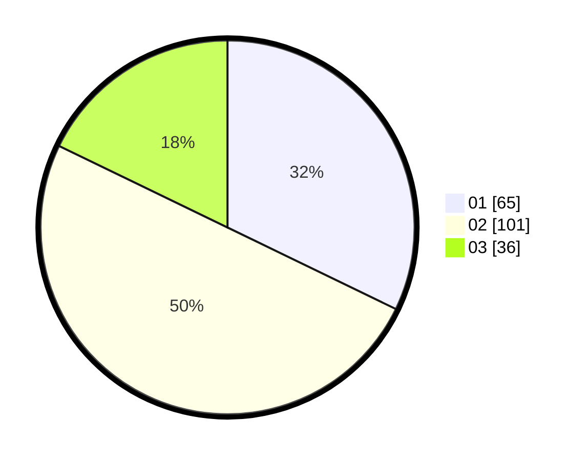

# Hasil

Hasil perolehan suara paslon dapat dilihat pada file paslon-01.txt, paslon-02.txt, dan paslon-03.txt.

Jika tidak ada, artinya data tersebut belum ada pada SIREKAP.

## Perolehan Suara

 * Paslon 01: **65**.
 * Paslon 02: **101**.
 * Paslon 03: **36**.

## Foto C Plano

https://sirekap-obj-formc.kpu.go.id/fe7c/pemilu/ppwp/31/73/05/10/06/3173051006005-20240215-013545--b22778b6-3ae9-449d-a6ba-23be6a9679b1.jpg

https://sirekap-obj-formc.kpu.go.id/fe7c/pemilu/ppwp/31/73/05/10/06/3173051006005-20240215-013648--b87560ec-020e-4d55-9824-dec227433d94.jpg

https://sirekap-obj-formc.kpu.go.id/fe7c/pemilu/ppwp/31/73/05/10/06/3173051006005-20240215-013745--e45e207a-f3e0-4fc9-8b0f-ad0ae3fb2332.jpg
