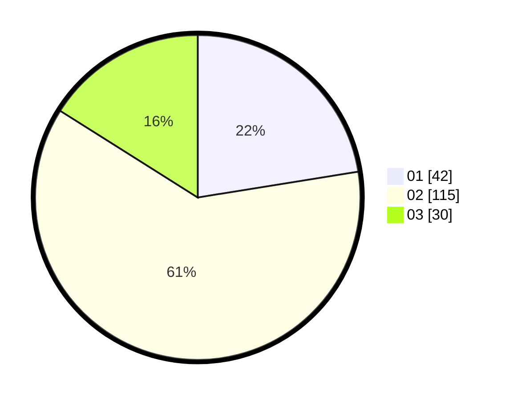

# Hasil

Hasil perolehan suara paslon dapat dilihat pada file paslon-01.txt, paslon-02.txt, dan paslon-03.txt.

Jika tidak ada, artinya data tersebut belum ada pada SIREKAP.

## Perolehan Suara

 * Paslon 01: **42**.
 * Paslon 02: **115**.
 * Paslon 03: **30**.

## Foto C Plano

https://sirekap-obj-formc.kpu.go.id/6622/pemilu/ppwp/31/73/05/10/06/3173051006006-20240214-222924--72f3ac3a-b71a-4a4d-81cf-02812988a000.jpg

https://sirekap-obj-formc.kpu.go.id/6622/pemilu/ppwp/31/73/05/10/06/3173051006006-20240214-220325--46561c81-4340-4f89-bbca-89c733d77656.jpg

https://sirekap-obj-formc.kpu.go.id/6622/pemilu/ppwp/31/73/05/10/06/3173051006006-20240214-220428--34c9ed75-a06e-4803-8712-e5795203d57a.jpg
