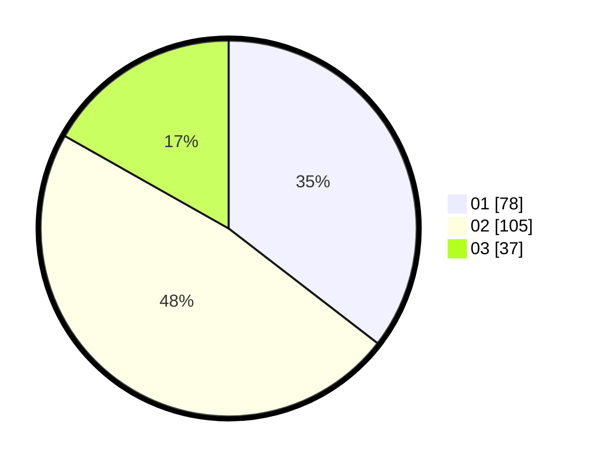

# Hasil

Hasil perolehan suara paslon dapat dilihat pada file paslon-01.txt, paslon-02.txt, dan paslon-03.txt.

Jika tidak ada, artinya data tersebut belum ada pada SIREKAP.

## Perolehan Suara

 * Paslon 01: **78**.
 * Paslon 02: **105**.
 * Paslon 03: **37**.

## Foto C Plano

https://sirekap-obj-formc.kpu.go.id/070d/pemilu/ppwp/31/73/05/10/06/3173051006011-20240215-093034--fe8bcfbe-706a-4905-aa50-8e6b47668f79.jpg

https://sirekap-obj-formc.kpu.go.id/070d/pemilu/ppwp/31/73/05/10/06/3173051006011-20240215-011522--e6aa69ea-1096-4c5d-a925-5d4dc7812bf0.jpg

https://sirekap-obj-formc.kpu.go.id/070d/pemilu/ppwp/31/73/05/10/06/3173051006011-20240215-093647--76340666-b186-48fb-a162-a9acf067d18d.jpg

## DATA PEMILIH TETAP

Jumlah pemilih dalam DPT: **293**.
 * L: **141**.
 * P: **152**.

## DATA PENGGUNA HAK PILIH

Jumlah pengguna hak pilih dalam DPT: **220**.
 * L: **104**.
 * P: **116**.

Jumlah pengguna hak pilih dalam DPTb: **0**.
 * L: **0**.
 * P: **0**.

Jumlah pengguna hak pilih dalam DPK: **0**.
 * L: **0**.
 * P: **0**.

Jumlah pengguna hak pilih: **220**.
 * L: **104**.
 * P: **116**.

## JUMLAH SUARA SAH DAN TIDAK SAH

JUMLAH SELURUH SUARA SAH: **220**.

JUMLAH SUARA TIDAK SAH: **0**.

JUMLAH SELURUH SUARA SAH DAN SUARA TIDAK SAH: **220**.
