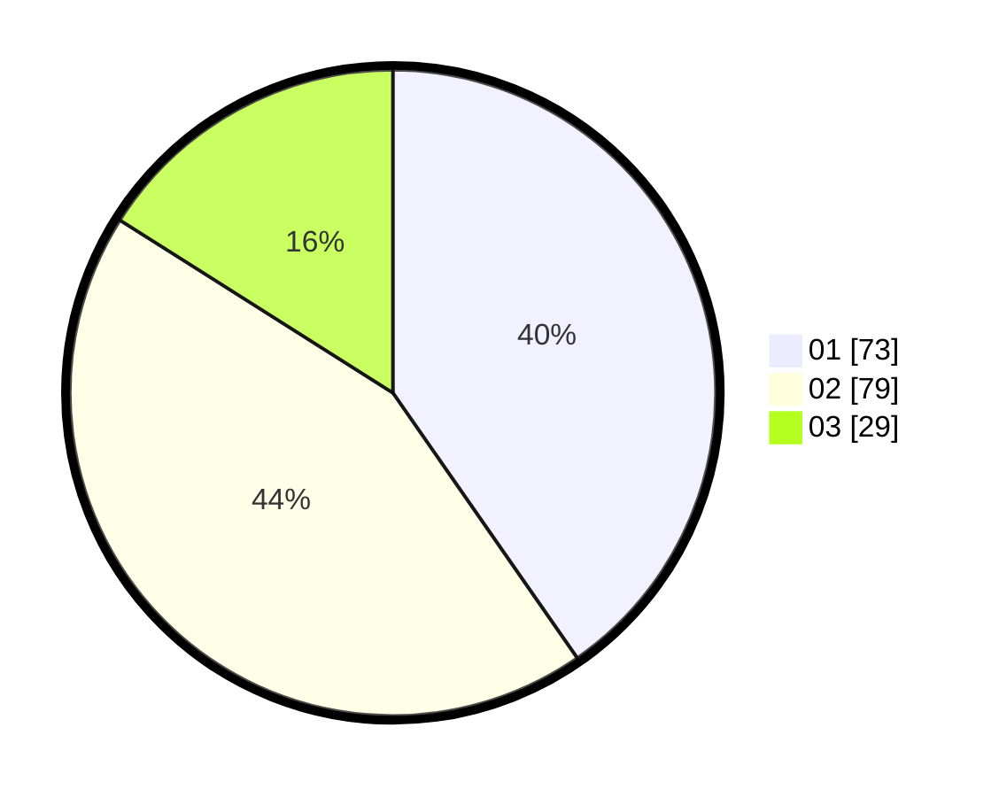

# Hasil

Hasil perolehan suara paslon dapat dilihat pada file paslon-01.txt, paslon-02.txt, dan paslon-03.txt.

Jika tidak ada, artinya data tersebut belum ada pada SIREKAP.

## Perolehan Suara

 * Paslon 01: **73**.
 * Paslon 02: **79**.
 * Paslon 03: **29**.

## Foto C Plano

https://sirekap-obj-formc.kpu.go.id/e8ee/pemilu/ppwp/31/73/05/10/06/3173051006016-20240214-155419--1b568f15-b145-4ee0-ad67-b8cc66e659d4.jpg

https://sirekap-obj-formc.kpu.go.id/e8ee/pemilu/ppwp/31/73/05/10/06/3173051006016-20240214-155242--62a1b56c-9e2c-4792-a0ff-4bb209f04932.jpg

https://sirekap-obj-formc.kpu.go.id/e8ee/pemilu/ppwp/31/73/05/10/06/3173051006016-20240214-155639--130c490e-1cef-4166-9777-f845d927f0b5.jpg
