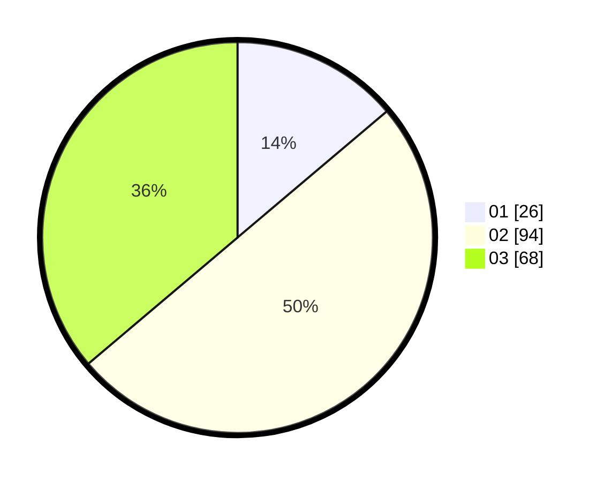

# Hasil

Hasil perolehan suara paslon dapat dilihat pada file paslon-01.txt, paslon-02.txt, dan paslon-03.txt.

Jika tidak ada, artinya data tersebut belum ada pada SIREKAP.

## Perolehan Suara

 * Paslon 01: **26**.
 * Paslon 02: **94**.
 * Paslon 03: **68**.

## Foto C Plano

https://sirekap-obj-formc.kpu.go.id/d4a9/pemilu/ppwp/31/73/05/10/06/3173051006017-20240214-211718--113eae4d-8f0a-4d49-8ee0-c004dd4c868b.jpg

https://sirekap-obj-formc.kpu.go.id/d4a9/pemilu/ppwp/31/73/05/10/06/3173051006017-20240214-212105--9b8f51de-85e9-4b5a-b422-02074e39a928.jpg

https://sirekap-obj-formc.kpu.go.id/d4a9/pemilu/ppwp/31/73/05/10/06/3173051006017-20240214-212244--bce236b8-163d-4c5c-b396-352a261d9adb.jpg

## DATA PEMILIH TETAP

Jumlah pemilih dalam DPT: **278**.
 * L: **135**.
 * P: **143**.

## DATA PENGGUNA HAK PILIH

Jumlah pengguna hak pilih dalam DPT: **168**.
 * L: **82**.
 * P: **86**.

Jumlah pengguna hak pilih dalam DPTb: **15**.
 * L: **6**.
 * P: **9**.

Jumlah pengguna hak pilih dalam DPK: **6**.
 * L: **2**.
 * P: **4**.

Jumlah pengguna hak pilih: **189**.
 * L: **90**.
 * P: **99**.

## JUMLAH SUARA SAH DAN TIDAK SAH

JUMLAH SELURUH SUARA SAH: **188**.

JUMLAH SUARA TIDAK SAH: **1**.

JUMLAH SELURUH SUARA SAH DAN SUARA TIDAK SAH: **189**.
