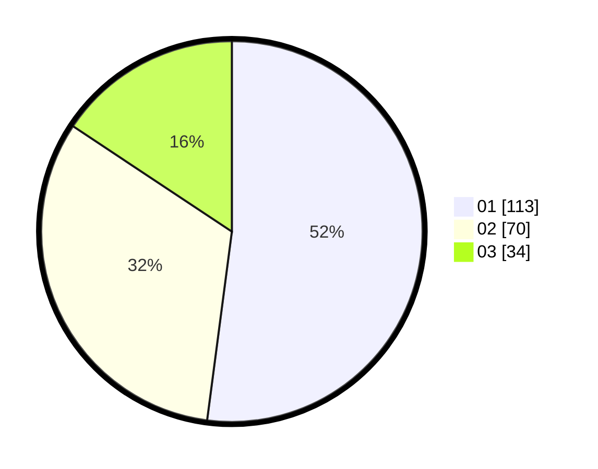

# Hasil

Hasil perolehan suara paslon dapat dilihat pada file paslon-01.txt, paslon-02.txt, dan paslon-03.txt.

Jika tidak ada, artinya data tersebut belum ada pada SIREKAP.

## Perolehan Suara

 * Paslon 01: **113**.
 * Paslon 02: **70**.
 * Paslon 03: **34**.

## Foto C Plano

https://sirekap-obj-formc.kpu.go.id/711b/pemilu/ppwp/31/73/05/10/06/3173051006018-20240216-000324--2ffc6194-6c66-4e81-8eaa-9b4f51783bde.jpg

https://sirekap-obj-formc.kpu.go.id/711b/pemilu/ppwp/31/73/05/10/06/3173051006018-20240217-122849--07b01c21-68ae-4859-8baa-e0999dbfe1b5.jpg

https://sirekap-obj-formc.kpu.go.id/711b/pemilu/ppwp/31/73/05/10/06/3173051006018-20240216-202859--e5f36032-7b5b-4dd2-bf7c-f1f73cf9524c.jpg

## DATA PEMILIH TETAP

Jumlah pemilih dalam DPT: **283**.
 * L: **137**.
 * P: **146**.

## DATA PENGGUNA HAK PILIH

Jumlah pengguna hak pilih dalam DPT: **219**.
 * L: **99**.
 * P: **120**.

Jumlah pengguna hak pilih dalam DPTb: **1**.
 * L: **0**.
 * P: **1**.

Jumlah pengguna hak pilih dalam DPK: **2**.
 * L: **0**.
 * P: **2**.

Jumlah pengguna hak pilih: **222**.
 * L: **99**.
 * P: **123**.

## JUMLAH SUARA SAH DAN TIDAK SAH

JUMLAH SELURUH SUARA SAH: **217**.

JUMLAH SUARA TIDAK SAH: **5**.

JUMLAH SELURUH SUARA SAH DAN SUARA TIDAK SAH: **222**.
