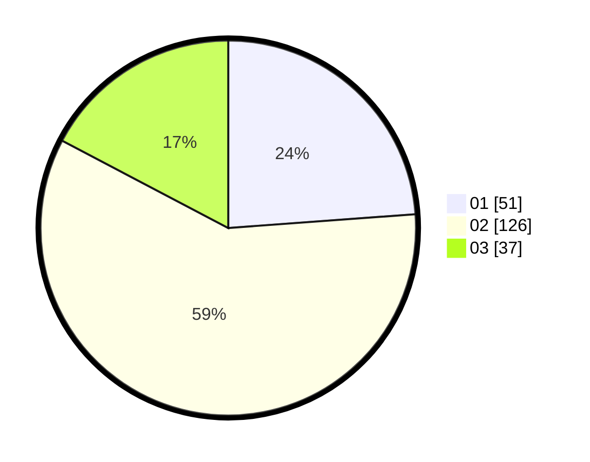

# Hasil

Hasil perolehan suara paslon dapat dilihat pada file paslon-01.txt, paslon-02.txt, dan paslon-03.txt.

Jika tidak ada, artinya data tersebut belum ada pada SIREKAP.

## Perolehan Suara

 * Paslon 01: **51**.
 * Paslon 02: **126**.
 * Paslon 03: **37**.

## Foto C Plano

https://sirekap-obj-formc.kpu.go.id/7dcb/pemilu/ppwp/31/73/05/10/06/3173051006022-20240215-212721--3d1d8225-f857-442c-9b3d-1003836ad541.jpg

https://sirekap-obj-formc.kpu.go.id/7dcb/pemilu/ppwp/31/73/05/10/06/3173051006022-20240215-212723--5f7d9c88-3cba-48ad-a70b-6090e96f53d9.jpg

https://sirekap-obj-formc.kpu.go.id/7dcb/pemilu/ppwp/31/73/05/10/06/3173051006022-20240215-212722--a1293a91-9226-476c-916b-ef338d73174e.jpg

## DATA PEMILIH TETAP

Jumlah pemilih dalam DPT: **277**.
 * L: **133**.
 * P: **144**.

## DATA PENGGUNA HAK PILIH

Jumlah pengguna hak pilih dalam DPT: **198**.
 * L: **85**.
 * P: **113**.

Jumlah pengguna hak pilih dalam DPTb: **16**.
 * L: **16**.
 * P: **0**.

Jumlah pengguna hak pilih dalam DPK: **2**.
 * L: **0**.
 * P: **2**.

Jumlah pengguna hak pilih: **216**.
 * L: **101**.
 * P: **115**.

## JUMLAH SUARA SAH DAN TIDAK SAH

JUMLAH SELURUH SUARA SAH: **214**.

JUMLAH SUARA TIDAK SAH: **2**.

JUMLAH SELURUH SUARA SAH DAN SUARA TIDAK SAH: **216**.
