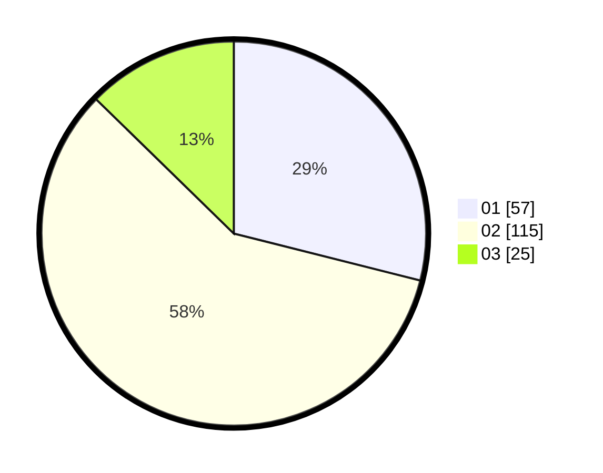

# Hasil

Hasil perolehan suara paslon dapat dilihat pada file paslon-01.txt, paslon-02.txt, dan paslon-03.txt.

Jika tidak ada, artinya data tersebut belum ada pada SIREKAP.

## Perolehan Suara

 * Paslon 01: **57**.
 * Paslon 02: **115**.
 * Paslon 03: **25**.

## Foto C Plano

https://sirekap-obj-formc.kpu.go.id/5777/pemilu/ppwp/31/73/05/10/06/3173051006028-20240214-204653--0b8a3be2-1836-4122-9254-46ae4921a4df.jpg

https://sirekap-obj-formc.kpu.go.id/5777/pemilu/ppwp/31/73/05/10/06/3173051006028-20240214-204845--614e285b-805a-4585-92db-fceb3ae12865.jpg

https://sirekap-obj-formc.kpu.go.id/5777/pemilu/ppwp/31/73/05/10/06/3173051006028-20240214-205910--d1c8fe2c-290a-4608-b58a-b499c5623a39.jpg

## DATA PEMILIH TETAP

Jumlah pemilih dalam DPT: **281**.
 * L: **143**.
 * P: **138**.

## DATA PENGGUNA HAK PILIH

Jumlah pengguna hak pilih dalam DPT: **200**.
 * L: **98**.
 * P: **102**.

Jumlah pengguna hak pilih dalam DPTb: **1**.
 * L: **1**.
 * P: **0**.

Jumlah pengguna hak pilih dalam DPK: **0**.
 * L: **0**.
 * P: **0**.

Jumlah pengguna hak pilih: **201**.
 * L: **99**.
 * P: **102**.

## JUMLAH SUARA SAH DAN TIDAK SAH

JUMLAH SELURUH SUARA SAH: **197**.

JUMLAH SUARA TIDAK SAH: **4**.

JUMLAH SELURUH SUARA SAH DAN SUARA TIDAK SAH: **201**.
