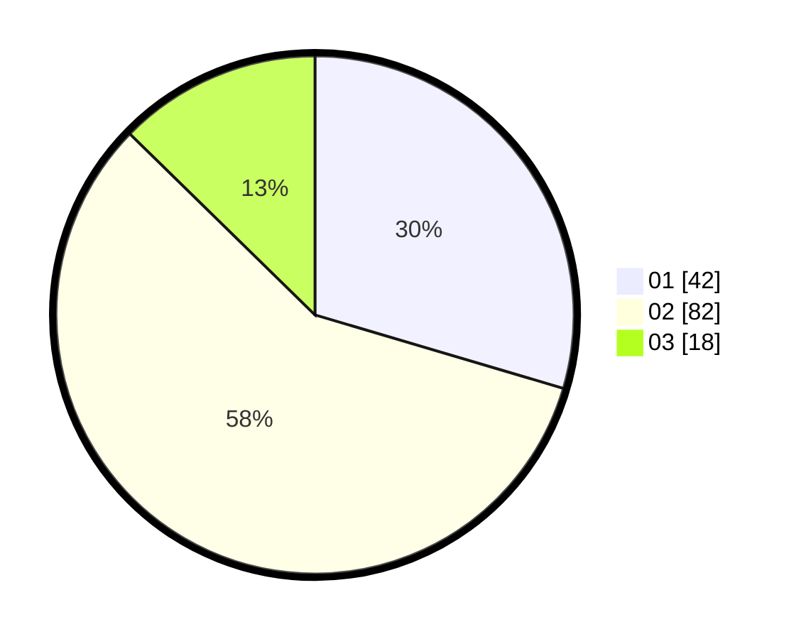

# Hasil

Hasil perolehan suara paslon dapat dilihat pada file paslon-01.txt, paslon-02.txt, dan paslon-03.txt.

Jika tidak ada, artinya data tersebut belum ada pada SIREKAP.

## Perolehan Suara

 * Paslon 01: **42**.
 * Paslon 02: **82**.
 * Paslon 03: **18**.

## Foto C Plano

https://sirekap-obj-formc.kpu.go.id/f098/pemilu/ppwp/31/73/05/10/06/3173051006030-20240215-044025--e89a23d9-05c9-4418-86c1-04db45564b86.jpg

https://sirekap-obj-formc.kpu.go.id/f098/pemilu/ppwp/31/73/05/10/06/3173051006030-20240215-044105--8e20d85d-87d7-443a-a22d-1bcc346ffda0.jpg

https://sirekap-obj-formc.kpu.go.id/f098/pemilu/ppwp/31/73/05/10/06/3173051006030-20240215-044142--fa37db87-a188-476f-be7e-f86adaadf6e8.jpg

## DATA PEMILIH TETAP

Jumlah pemilih dalam DPT: **203**.
 * L: **99**.
 * P: **104**.

## DATA PENGGUNA HAK PILIH

Jumlah pengguna hak pilih dalam DPT: **146**.
 * L: **64**.
 * P: **82**.

Jumlah pengguna hak pilih dalam DPTb: **0**.
 * L: **0**.
 * P: **0**.

Jumlah pengguna hak pilih dalam DPK: **1**.
 * L: **0**.
 * P: **1**.

Jumlah pengguna hak pilih: **147**.
 * L: **64**.
 * P: **83**.

## JUMLAH SUARA SAH DAN TIDAK SAH

JUMLAH SELURUH SUARA SAH: **142**.

JUMLAH SUARA TIDAK SAH: **5**.

JUMLAH SELURUH SUARA SAH DAN SUARA TIDAK SAH: **147**.
