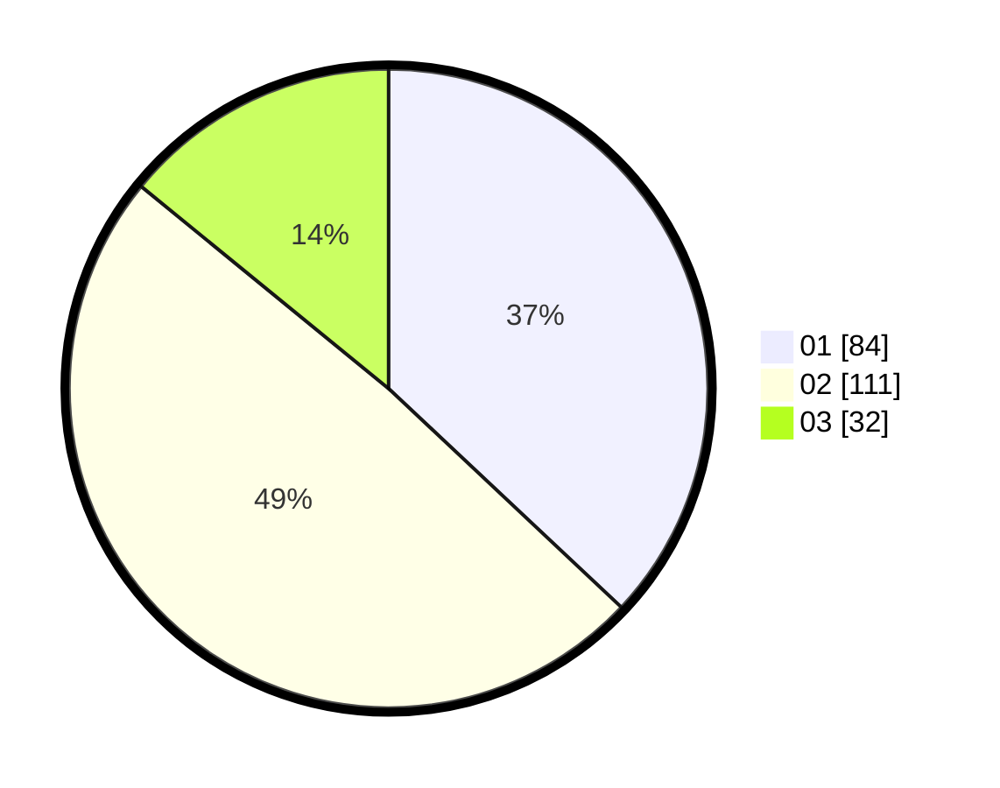

# Hasil

Hasil perolehan suara paslon dapat dilihat pada file paslon-01.txt, paslon-02.txt, dan paslon-03.txt.

Jika tidak ada, artinya data tersebut belum ada pada SIREKAP.

## Perolehan Suara

 * Paslon 01: **84**.
 * Paslon 02: **111**.
 * Paslon 03: **32**.

## Foto C Plano

https://sirekap-obj-formc.kpu.go.id/2656/pemilu/ppwp/31/73/05/10/06/3173051006031-20240216-144538--6c4d5987-018f-403f-9180-ce3d836dc8cc.jpg

https://sirekap-obj-formc.kpu.go.id/2656/pemilu/ppwp/31/73/05/10/06/3173051006031-20240214-200548--b2d7107c-0e5d-48eb-9490-b9b376e61a36.jpg

https://sirekap-obj-formc.kpu.go.id/2656/pemilu/ppwp/31/73/05/10/06/3173051006031-20240214-200514--5277b74e-cbff-46f6-b4a3-c82ebc1d3c2c.jpg

## DATA PEMILIH TETAP

Jumlah pemilih dalam DPT: **288**.
 * L: **143**.
 * P: **145**.

## DATA PENGGUNA HAK PILIH

Jumlah pengguna hak pilih dalam DPT: **236**.
 * L: **113**.
 * P: **123**.

Jumlah pengguna hak pilih dalam DPTb: **0**.
 * L: **0**.
 * P: **0**.

Jumlah pengguna hak pilih dalam DPK: **0**.
 * L: **0**.
 * P: **0**.

Jumlah pengguna hak pilih: **236**.
 * L: **113**.
 * P: **123**.

## JUMLAH SUARA SAH DAN TIDAK SAH

JUMLAH SELURUH SUARA SAH: **227**.

JUMLAH SUARA TIDAK SAH: **9**.

JUMLAH SELURUH SUARA SAH DAN SUARA TIDAK SAH: **0**.
