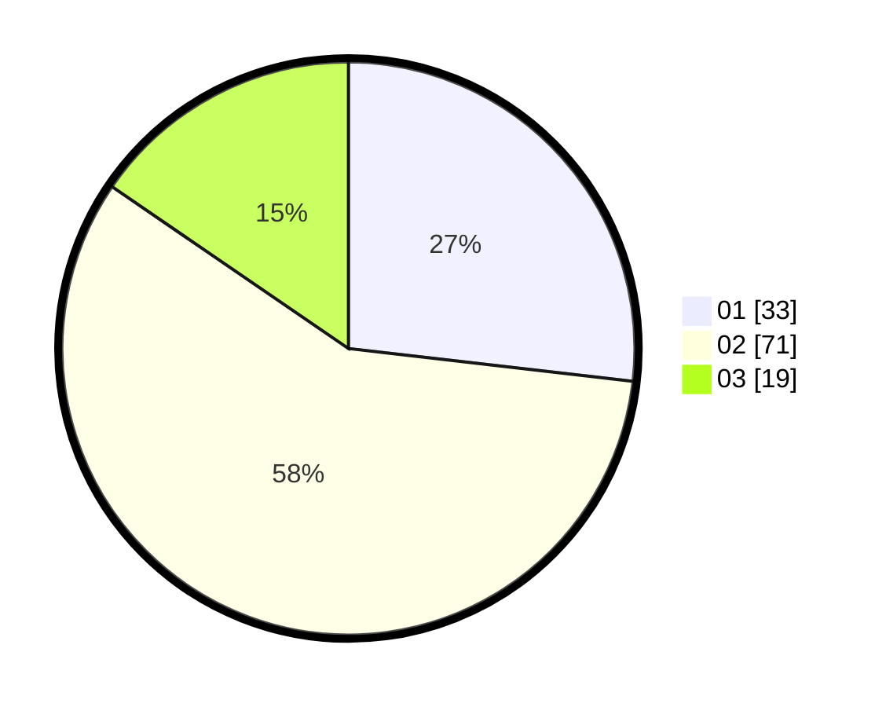

# Hasil

Hasil perolehan suara paslon dapat dilihat pada file paslon-01.txt, paslon-02.txt, dan paslon-03.txt.

Jika tidak ada, artinya data tersebut belum ada pada SIREKAP.

## Perolehan Suara

 * Paslon 01: **33**.
 * Paslon 02: **71**.
 * Paslon 03: **19**.

## Foto C Plano

https://sirekap-obj-formc.kpu.go.id/af90/pemilu/ppwp/31/73/05/10/06/3173051006032-20240216-142156--b5377ff9-7de3-41db-94fe-1a2b2ca63032.jpg

https://sirekap-obj-formc.kpu.go.id/af90/pemilu/ppwp/31/73/05/10/06/3173051006032-20240216-142157--80e2c0a7-1815-446b-bbc3-a3b12dd43819.jpg

https://sirekap-obj-formc.kpu.go.id/af90/pemilu/ppwp/31/73/05/10/06/3173051006032-20240216-142156--53e8393f-2af8-4361-947f-a210a797aa11.jpg

## DATA PEMILIH TETAP

Jumlah pemilih dalam DPT: **152**.
 * L: **84**.
 * P: **68**.

## DATA PENGGUNA HAK PILIH

Jumlah pengguna hak pilih dalam DPT: **125**.
 * L: **65**.
 * P: **60**.

Jumlah pengguna hak pilih dalam DPTb: **0**.
 * L: **0**.
 * P: **0**.

Jumlah pengguna hak pilih dalam DPK: **0**.
 * L: **0**.
 * P: **0**.

Jumlah pengguna hak pilih: **125**.
 * L: **65**.
 * P: **60**.

## JUMLAH SUARA SAH DAN TIDAK SAH

JUMLAH SELURUH SUARA SAH: **123**.

JUMLAH SUARA TIDAK SAH: **2**.

JUMLAH SELURUH SUARA SAH DAN SUARA TIDAK SAH: **125**.
