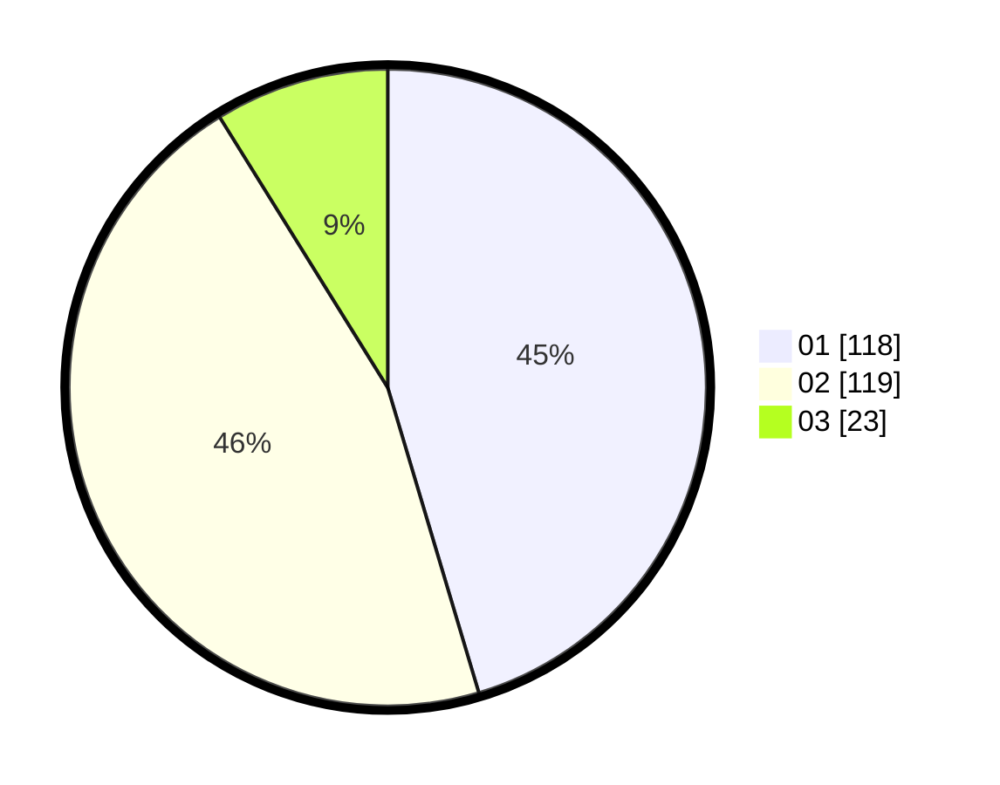

# Hasil

Hasil perolehan suara paslon dapat dilihat pada file paslon-01.txt, paslon-02.txt, dan paslon-03.txt.

Jika tidak ada, artinya data tersebut belum ada pada SIREKAP.

## Perolehan Suara

 * Paslon 01: **118**.
 * Paslon 02: **119**.
 * Paslon 03: **23**.

## Foto C Plano

https://sirekap-obj-formc.kpu.go.id/380f/pemilu/ppwp/31/73/05/10/06/3173051006034-20240216-163948--3d6d3462-7677-4d5a-bf4f-23c98e730987.jpg

https://sirekap-obj-formc.kpu.go.id/380f/pemilu/ppwp/31/73/05/10/06/3173051006034-20240218-140327--2186a6de-43f2-4902-bd59-ebbc94a96217.jpg

https://sirekap-obj-formc.kpu.go.id/380f/pemilu/ppwp/31/73/05/10/06/3173051006034-20240218-140326--0a9ca09e-a4d4-4f98-bccb-b7d7a03c8854.jpg

## DATA PEMILIH TETAP

Jumlah pemilih dalam DPT: **288**.
 * L: **149**.
 * P: **139**.

## DATA PENGGUNA HAK PILIH

Jumlah pengguna hak pilih dalam DPT: **261**.
 * L: **136**.
 * P: **125**.

Jumlah pengguna hak pilih dalam DPTb: **0**.
 * L: **0**.
 * P: **0**.

Jumlah pengguna hak pilih dalam DPK: **0**.
 * L: **0**.
 * P: **0**.

Jumlah pengguna hak pilih: **261**.
 * L: **136**.
 * P: **125**.

## JUMLAH SUARA SAH DAN TIDAK SAH

JUMLAH SELURUH SUARA SAH: **260**.

JUMLAH SUARA TIDAK SAH: **1**.

JUMLAH SELURUH SUARA SAH DAN SUARA TIDAK SAH: **261**.
