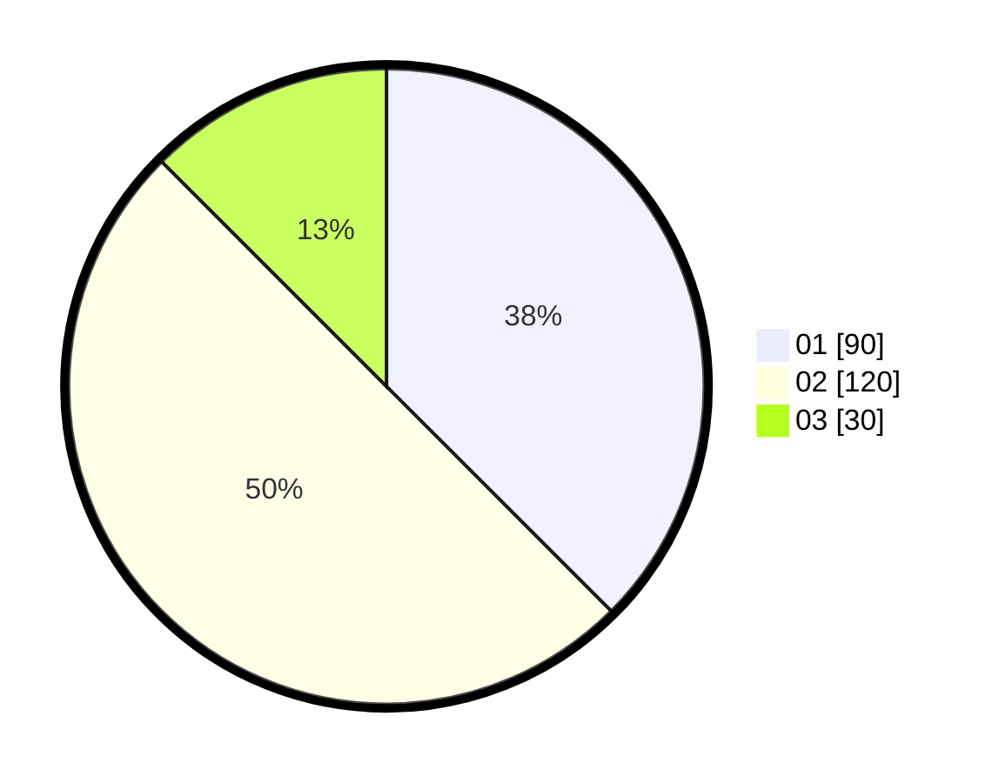

# Hasil

Hasil perolehan suara paslon dapat dilihat pada file paslon-01.txt, paslon-02.txt, dan paslon-03.txt.

Jika tidak ada, artinya data tersebut belum ada pada SIREKAP.

## Perolehan Suara

 * Paslon 01: **90**.
 * Paslon 02: **120**.
 * Paslon 03: **30**.

## Foto C Plano

https://sirekap-obj-formc.kpu.go.id/17b9/pemilu/ppwp/31/73/05/10/06/3173051006036-20240215-022815--d2b0374a-f947-48ce-bf00-c02582157838.jpg

https://sirekap-obj-formc.kpu.go.id/17b9/pemilu/ppwp/31/73/05/10/06/3173051006036-20240215-022837--4fb8ffdc-0f11-4986-9430-44cd8b6d8ff1.jpg

https://sirekap-obj-formc.kpu.go.id/17b9/pemilu/ppwp/31/73/05/10/06/3173051006036-20240215-022826--c9aa2d14-582c-4764-915a-ea08bf0bd628.jpg

## DATA PEMILIH TETAP

Jumlah pemilih dalam DPT: **285**.
 * L: **154**.
 * P: **131**.

## DATA PENGGUNA HAK PILIH

Jumlah pengguna hak pilih dalam DPT: **238**.
 * L: **127**.
 * P: **111**.

Jumlah pengguna hak pilih dalam DPTb: **0**.
 * L: **0**.
 * P: **0**.

Jumlah pengguna hak pilih dalam DPK: **4**.
 * L: **3**.
 * P: **1**.

Jumlah pengguna hak pilih: **242**.
 * L: **130**.
 * P: **112**.

## JUMLAH SUARA SAH DAN TIDAK SAH

JUMLAH SELURUH SUARA SAH: **240**.

JUMLAH SUARA TIDAK SAH: **2**.

JUMLAH SELURUH SUARA SAH DAN SUARA TIDAK SAH: **242**.
