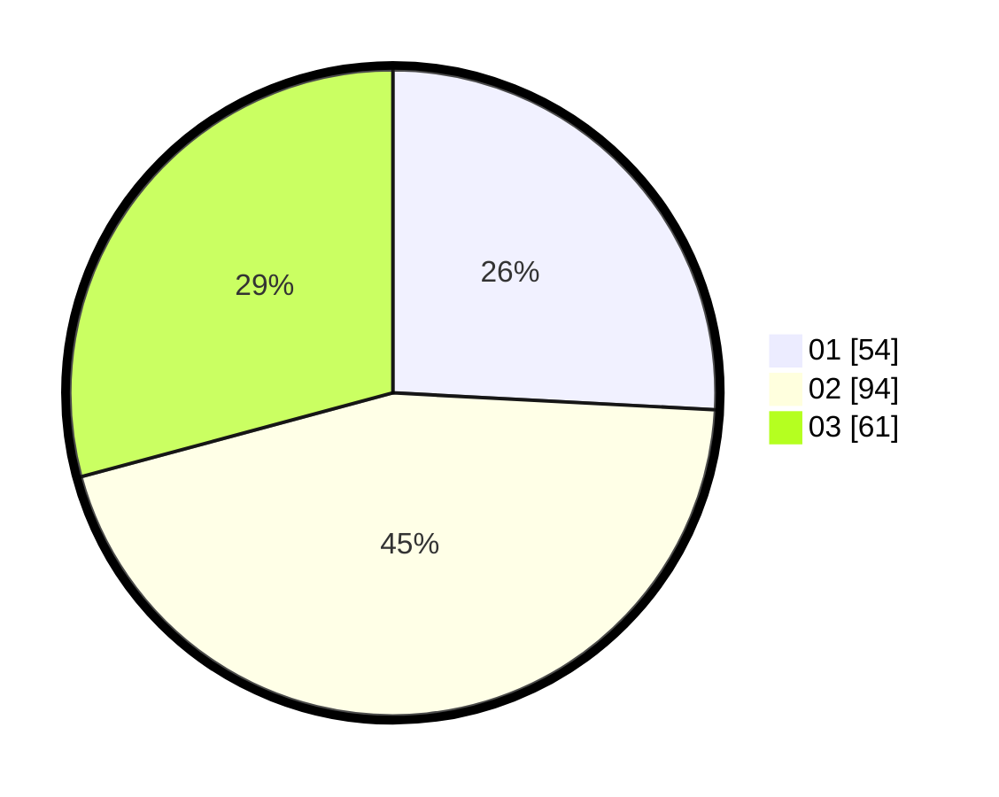

# Hasil

Hasil perolehan suara paslon dapat dilihat pada file paslon-01.txt, paslon-02.txt, dan paslon-03.txt.

Jika tidak ada, artinya data tersebut belum ada pada SIREKAP.

## Perolehan Suara

 * Paslon 01: **54**.
 * Paslon 02: **94**.
 * Paslon 03: **61**.

## Foto C Plano

https://sirekap-obj-formc.kpu.go.id/a2ad/pemilu/ppwp/31/73/05/10/06/3173051006049-20240216-085255--564e4733-3ffc-413b-8883-0d61d83e77ba.jpg

https://sirekap-obj-formc.kpu.go.id/a2ad/pemilu/ppwp/31/73/05/10/06/3173051006049-20240216-085256--4ce691d8-a2a1-483e-8c90-9a3f71f11185.jpg

https://sirekap-obj-formc.kpu.go.id/a2ad/pemilu/ppwp/31/73/05/10/06/3173051006049-20240216-085256--f640c0d4-8de6-40ee-ae5b-5a28ada6783a.jpg

## DATA PEMILIH TETAP

Jumlah pemilih dalam DPT: **288**.
 * L: **144**.
 * P: **144**.

## DATA PENGGUNA HAK PILIH

Jumlah pengguna hak pilih dalam DPT: **209**.
 * L: **108**.
 * P: **101**.

Jumlah pengguna hak pilih dalam DPTb: **5**.
 * L: **4**.
 * P: **1**.

Jumlah pengguna hak pilih dalam DPK: **3**.
 * L: **2**.
 * P: **1**.

Jumlah pengguna hak pilih: **217**.
 * L: **114**.
 * P: **103**.

## JUMLAH SUARA SAH DAN TIDAK SAH

JUMLAH SELURUH SUARA SAH: **209**.

JUMLAH SUARA TIDAK SAH: **8**.

JUMLAH SELURUH SUARA SAH DAN SUARA TIDAK SAH: **217**.
