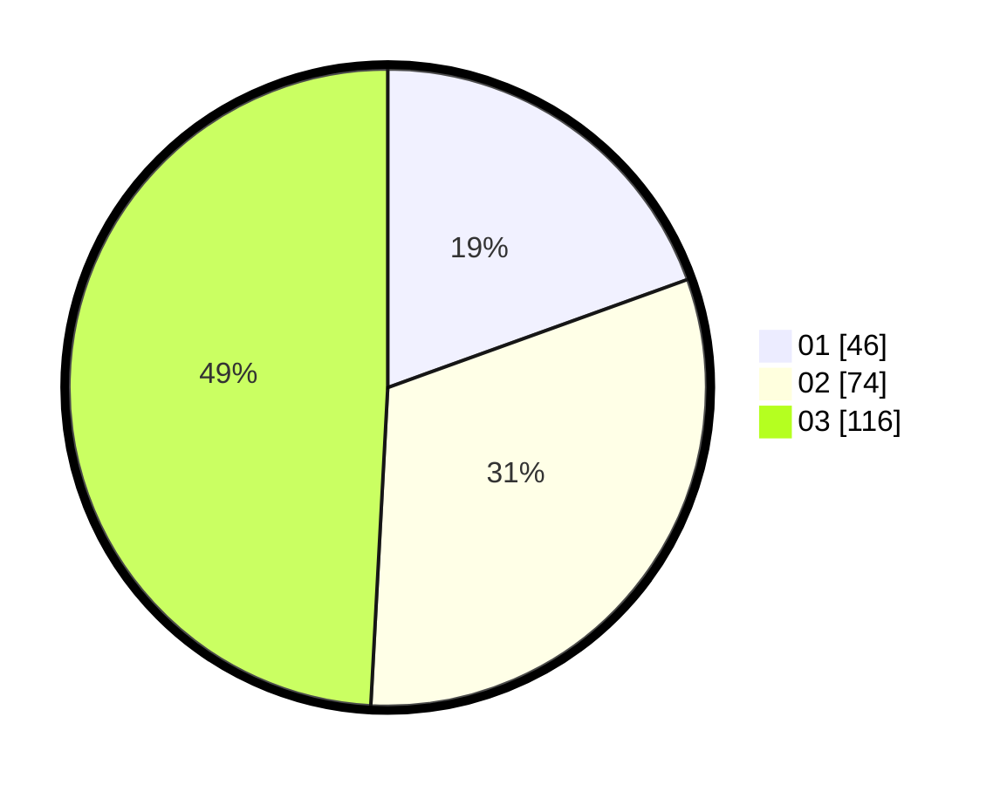

# Hasil

Hasil perolehan suara paslon dapat dilihat pada file paslon-01.txt, paslon-02.txt, dan paslon-03.txt.

Jika tidak ada, artinya data tersebut belum ada pada SIREKAP.

## Perolehan Suara

 * Paslon 01: **46**.
 * Paslon 02: **74**.
 * Paslon 03: **116**.

## Foto C Plano

https://sirekap-obj-formc.kpu.go.id/ac22/pemilu/ppwp/31/73/05/10/06/3173051006051-20240216-144751--a1138223-0a26-4bc4-9f1b-cf04af27196d.jpg

https://sirekap-obj-formc.kpu.go.id/ac22/pemilu/ppwp/31/73/05/10/06/3173051006051-20240216-144752--d67fd2f6-8d46-4076-bc8f-7b85c5464ae3.jpg

https://sirekap-obj-formc.kpu.go.id/ac22/pemilu/ppwp/31/73/05/10/06/3173051006051-20240216-144751--7d8d19cd-a14d-496e-819c-5bb62847e1ec.jpg

## DATA PEMILIH TETAP

Jumlah pemilih dalam DPT: **300**.
 * L: **144**.
 * P: **156**.

## DATA PENGGUNA HAK PILIH

Jumlah pengguna hak pilih dalam DPT: **226**.
 * L: **103**.
 * P: **123**.

Jumlah pengguna hak pilih dalam DPTb: **6**.
 * L: **3**.
 * P: **3**.

Jumlah pengguna hak pilih dalam DPK: **4**.
 * L: **3**.
 * P: **1**.

Jumlah pengguna hak pilih: **236**.
 * L: **109**.
 * P: **127**.

## JUMLAH SUARA SAH DAN TIDAK SAH

JUMLAH SELURUH SUARA SAH: **236**.

JUMLAH SUARA TIDAK SAH: **1**.

JUMLAH SELURUH SUARA SAH DAN SUARA TIDAK SAH: **237**.
