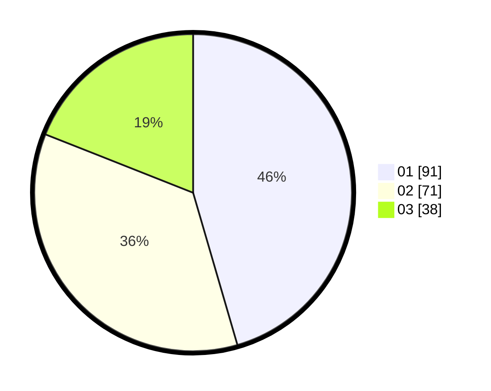

# Hasil

Hasil perolehan suara paslon dapat dilihat pada file paslon-01.txt, paslon-02.txt, dan paslon-03.txt.

Jika tidak ada, artinya data tersebut belum ada pada SIREKAP.

## Perolehan Suara

 * Paslon 01: **91**.
 * Paslon 02: **71**.
 * Paslon 03: **38**.

## Foto C Plano

https://sirekap-obj-formc.kpu.go.id/7db2/pemilu/ppwp/31/73/05/10/06/3173051006052-20240214-192915--ba9eb3de-f1af-407a-b5c3-06d3d268168c.jpg

https://sirekap-obj-formc.kpu.go.id/7db2/pemilu/ppwp/31/73/05/10/06/3173051006052-20240214-192648--8b771864-854c-49a7-85e5-4dd8a193a184.jpg

https://sirekap-obj-formc.kpu.go.id/7db2/pemilu/ppwp/31/73/05/10/06/3173051006052-20240214-192904--f91ec070-93ee-490b-a9b2-43973206b28e.jpg
