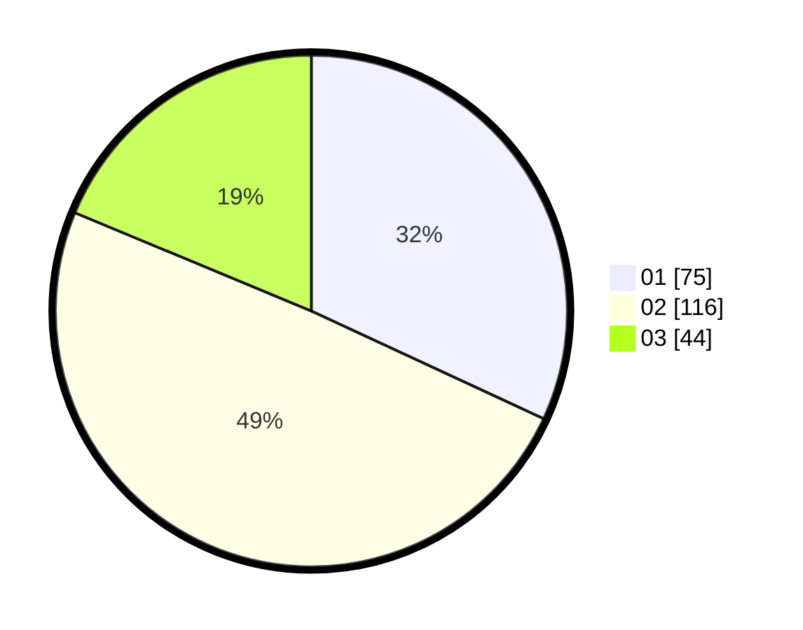

# Hasil

Hasil perolehan suara paslon dapat dilihat pada file paslon-01.txt, paslon-02.txt, dan paslon-03.txt.

Jika tidak ada, artinya data tersebut belum ada pada SIREKAP.

## Perolehan Suara

 * Paslon 01: **75**.
 * Paslon 02: **116**.
 * Paslon 03: **44**.

## Foto C Plano

https://sirekap-obj-formc.kpu.go.id/0538/pemilu/ppwp/31/73/05/10/06/3173051006053-20240216-192956--6b40d326-591a-4154-95cd-84cd369233dc.jpg

https://sirekap-obj-formc.kpu.go.id/0538/pemilu/ppwp/31/73/05/10/06/3173051006053-20240216-192957--1838d6a7-d73e-4354-acd5-7d23f993cdec.jpg

https://sirekap-obj-formc.kpu.go.id/0538/pemilu/ppwp/31/73/05/10/06/3173051006053-20240216-192957--dd89390a-858a-488a-867d-1c33c2f5215a.jpg

## DATA PEMILIH TETAP

Jumlah pemilih dalam DPT: **284**.
 * L: **152**.
 * P: **132**.

## DATA PENGGUNA HAK PILIH

Jumlah pengguna hak pilih dalam DPT: **230**.
 * L: **121**.
 * P: **109**.

Jumlah pengguna hak pilih dalam DPTb: **2**.
 * L: **0**.
 * P: **2**.

Jumlah pengguna hak pilih dalam DPK: **3**.
 * L: **2**.
 * P: **1**.

Jumlah pengguna hak pilih: **235**.
 * L: **123**.
 * P: **112**.

## JUMLAH SUARA SAH DAN TIDAK SAH

JUMLAH SELURUH SUARA SAH: **235**.

JUMLAH SUARA TIDAK SAH: **2**.

JUMLAH SELURUH SUARA SAH DAN SUARA TIDAK SAH: **237**.
