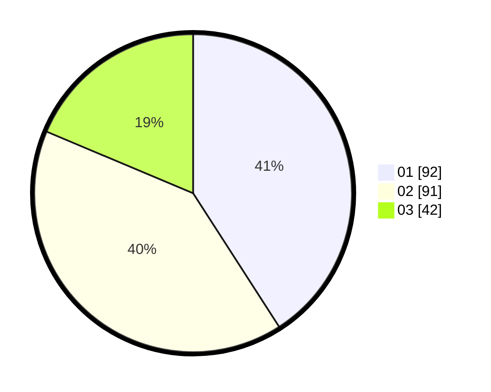

# Hasil

Hasil perolehan suara paslon dapat dilihat pada file paslon-01.txt, paslon-02.txt, dan paslon-03.txt.

Jika tidak ada, artinya data tersebut belum ada pada SIREKAP.

## Perolehan Suara

 * Paslon 01: **92**.
 * Paslon 02: **91**.
 * Paslon 03: **42**.

## Foto C Plano

https://sirekap-obj-formc.kpu.go.id/2795/pemilu/ppwp/31/73/05/10/06/3173051006054-20240216-042805--122a66d7-7be6-4532-9a5a-dd08cd25bc1a.jpg

https://sirekap-obj-formc.kpu.go.id/2795/pemilu/ppwp/31/73/05/10/06/3173051006054-20240216-042821--cc8a5db3-d1a8-4246-8a7d-4be64d408781.jpg

https://sirekap-obj-formc.kpu.go.id/2795/pemilu/ppwp/31/73/05/10/06/3173051006054-20240216-045400--90b32d25-0545-484f-89d5-2ee6bc8dba66.jpg

## DATA PEMILIH TETAP

Jumlah pemilih dalam DPT: **293**.
 * L: **144**.
 * P: **149**.

## DATA PENGGUNA HAK PILIH

Jumlah pengguna hak pilih dalam DPT: **226**.
 * L: **112**.
 * P: **114**.

Jumlah pengguna hak pilih dalam DPTb: **1**.
 * L: **1**.
 * P: **0**.

Jumlah pengguna hak pilih dalam DPK: **2**.
 * L: **0**.
 * P: **2**.

Jumlah pengguna hak pilih: **229**.
 * L: **113**.
 * P: **116**.

## JUMLAH SUARA SAH DAN TIDAK SAH

JUMLAH SELURUH SUARA SAH: **225**.

JUMLAH SUARA TIDAK SAH: **4**.

JUMLAH SELURUH SUARA SAH DAN SUARA TIDAK SAH: **229**.
