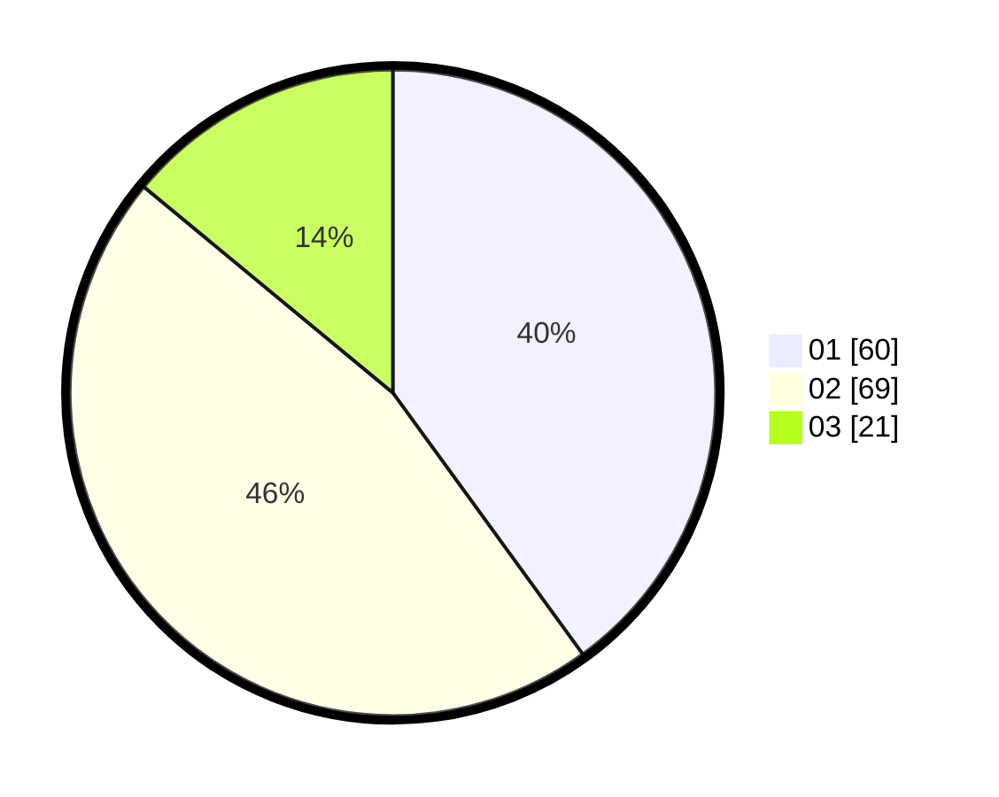

# Hasil

Hasil perolehan suara paslon dapat dilihat pada file paslon-01.txt, paslon-02.txt, dan paslon-03.txt.

Jika tidak ada, artinya data tersebut belum ada pada SIREKAP.

## Perolehan Suara

 * Paslon 01: **60**.
 * Paslon 02: **69**.
 * Paslon 03: **21**.

## Foto C Plano

https://sirekap-obj-formc.kpu.go.id/2a76/pemilu/ppwp/31/73/05/10/06/3173051006056-20240215-223610--8327eeee-9e3c-4a21-afbe-591fb348232a.jpg

https://sirekap-obj-formc.kpu.go.id/2a76/pemilu/ppwp/31/73/05/10/06/3173051006056-20240215-223614--a912bd08-2b57-4a35-9364-17e3d69ab148.jpg

https://sirekap-obj-formc.kpu.go.id/2a76/pemilu/ppwp/31/73/05/10/06/3173051006056-20240215-223612--0b81d325-e7dc-4be7-907d-a37392fb77bc.jpg

## DATA PEMILIH TETAP

Jumlah pemilih dalam DPT: **209**.
 * L: **104**.
 * P: **105**.

## DATA PENGGUNA HAK PILIH

Jumlah pengguna hak pilih dalam DPT: **147**.
 * L: **70**.
 * P: **77**.

Jumlah pengguna hak pilih dalam DPTb: **2**.
 * L: **2**.
 * P: **0**.

Jumlah pengguna hak pilih dalam DPK: **3**.
 * L: **2**.
 * P: **1**.

Jumlah pengguna hak pilih: **152**.
 * L: **74**.
 * P: **78**.

## JUMLAH SUARA SAH DAN TIDAK SAH

JUMLAH SELURUH SUARA SAH: **150**.

JUMLAH SUARA TIDAK SAH: **2**.

JUMLAH SELURUH SUARA SAH DAN SUARA TIDAK SAH: **152**.
