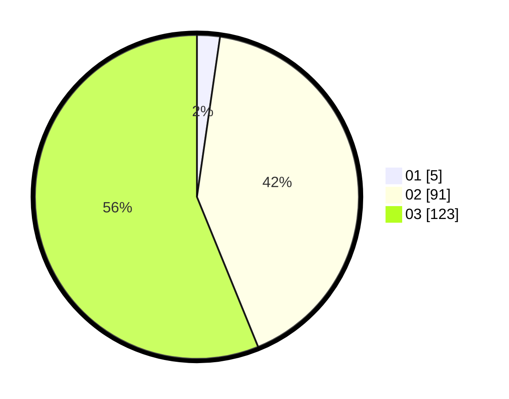

# Hasil

Hasil perolehan suara paslon dapat dilihat pada file paslon-01.txt, paslon-02.txt, dan paslon-03.txt.

Jika tidak ada, artinya data tersebut belum ada pada SIREKAP.

## Perolehan Suara

 * Paslon 01: **5**.
 * Paslon 02: **91**.
 * Paslon 03: **123**.

## Foto C Plano

https://sirekap-obj-formc.kpu.go.id/e7a5/pemilu/ppwp/31/73/05/10/06/3173051006059-20240214-155552--6113a716-7297-43b2-8390-72127fc395f6.jpg

https://sirekap-obj-formc.kpu.go.id/e7a5/pemilu/ppwp/31/73/05/10/06/3173051006059-20240216-142146--d65df56b-cb7e-45ae-b0fb-1d1a281022f8.jpg

https://sirekap-obj-formc.kpu.go.id/e7a5/pemilu/ppwp/31/73/05/10/06/3173051006059-20240216-142145--a5244c0f-e469-4bb0-8b9a-efa83249bdcf.jpg

## DATA PEMILIH TETAP

Jumlah pemilih dalam DPT: **293**.
 * L: **142**.
 * P: **151**.

## DATA PENGGUNA HAK PILIH

Jumlah pengguna hak pilih dalam DPT: **215**.
 * L: **105**.
 * P: **110**.

Jumlah pengguna hak pilih dalam DPTb: **5**.
 * L: **4**.
 * P: **1**.

Jumlah pengguna hak pilih dalam DPK: **1**.
 * L: **1**.
 * P: **0**.

Jumlah pengguna hak pilih: **221**.
 * L: **110**.
 * P: **111**.

## JUMLAH SUARA SAH DAN TIDAK SAH

JUMLAH SELURUH SUARA SAH: **219**.

JUMLAH SUARA TIDAK SAH: **2**.

JUMLAH SELURUH SUARA SAH DAN SUARA TIDAK SAH: **221**.
