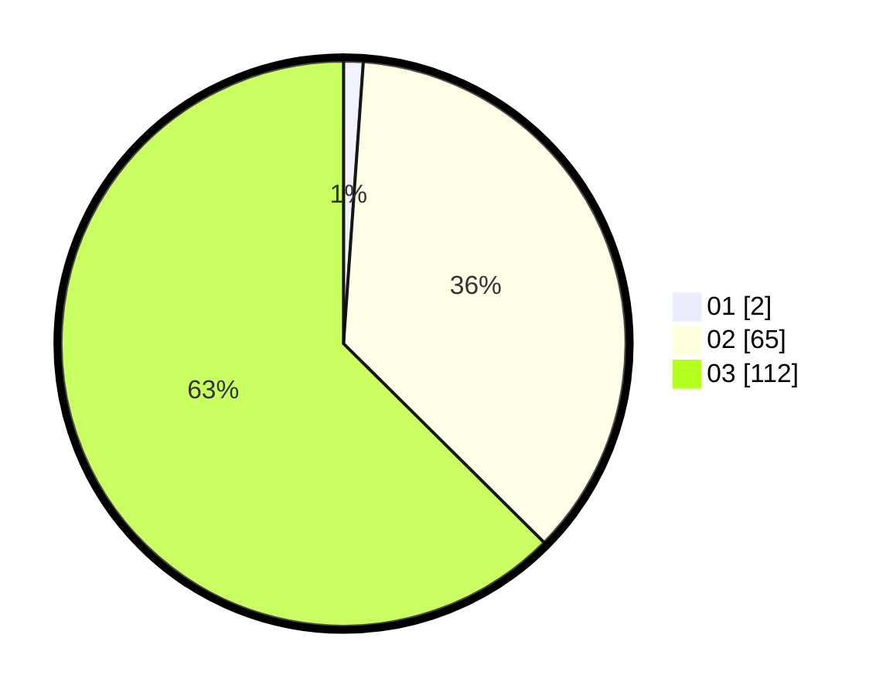

# Hasil

Hasil perolehan suara paslon dapat dilihat pada file paslon-01.txt, paslon-02.txt, dan paslon-03.txt.

Jika tidak ada, artinya data tersebut belum ada pada SIREKAP.

## Perolehan Suara

 * Paslon 01: **2**.
 * Paslon 02: **65**.
 * Paslon 03: **112**.

## Foto C Plano

https://sirekap-obj-formc.kpu.go.id/a413/pemilu/ppwp/31/73/05/10/06/3173051006061-20240215-231551--c7110088-8c9b-4e8d-9102-058118334ff3.jpg

https://sirekap-obj-formc.kpu.go.id/a413/pemilu/ppwp/31/73/05/10/06/3173051006061-20240215-231558--98d60cee-bb48-41af-b66c-63130b8e82b0.jpg

https://sirekap-obj-formc.kpu.go.id/a413/pemilu/ppwp/31/73/05/10/06/3173051006061-20240215-231555--bd8e76ce-7274-489a-a224-3ee1292bea9b.jpg

## DATA PEMILIH TETAP

Jumlah pemilih dalam DPT: **255**.
 * L: **125**.
 * P: **130**.

## DATA PENGGUNA HAK PILIH

Jumlah pengguna hak pilih dalam DPT: **176**.
 * L: **89**.
 * P: **87**.

Jumlah pengguna hak pilih dalam DPTb: **6**.
 * L: **1**.
 * P: **5**.

Jumlah pengguna hak pilih dalam DPK: **3**.
 * L: **0**.
 * P: **3**.

Jumlah pengguna hak pilih: **185**.
 * L: **90**.
 * P: **95**.

## JUMLAH SUARA SAH DAN TIDAK SAH

JUMLAH SELURUH SUARA SAH: **179**.

JUMLAH SUARA TIDAK SAH: **6**.

JUMLAH SELURUH SUARA SAH DAN SUARA TIDAK SAH: **185**.
