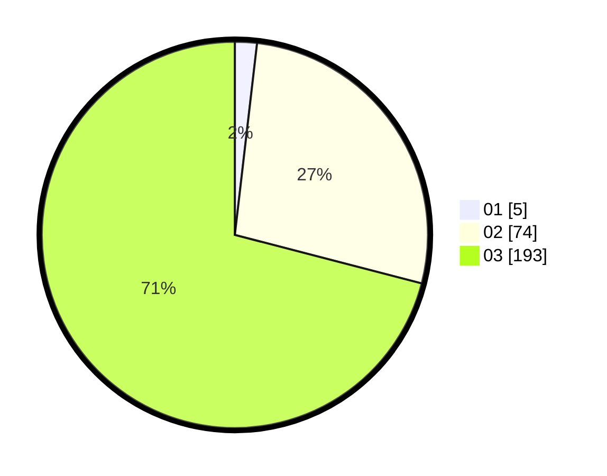

# Hasil

Hasil perolehan suara paslon dapat dilihat pada file paslon-01.txt, paslon-02.txt, dan paslon-03.txt.

Jika tidak ada, artinya data tersebut belum ada pada SIREKAP.

## Perolehan Suara

 * Paslon 01: **5**.
 * Paslon 02: **74**.
 * Paslon 03: **193**.

## Foto C Plano

https://sirekap-obj-formc.kpu.go.id/08bd/pemilu/ppwp/31/73/05/10/06/3173051006068-20240216-031036--d05f9c65-e303-483a-99c6-c38be14ce4e7.jpg

https://sirekap-obj-formc.kpu.go.id/08bd/pemilu/ppwp/31/73/05/10/06/3173051006068-20240216-031044--c1da8a22-51b6-404b-86cd-52c73af73400.jpg

https://sirekap-obj-formc.kpu.go.id/08bd/pemilu/ppwp/31/73/05/10/06/3173051006068-20240216-031039--17da029c-059c-4486-9c5f-a57464a9dafa.jpg

## DATA PEMILIH TETAP

Jumlah pemilih dalam DPT: **299**.
 * L: **140**.
 * P: **159**.

## DATA PENGGUNA HAK PILIH

Jumlah pengguna hak pilih dalam DPT: **249**.
 * L: **117**.
 * P: **132**.

Jumlah pengguna hak pilih dalam DPTb: **20**.
 * L: **2**.
 * P: **18**.

Jumlah pengguna hak pilih dalam DPK: **5**.
 * L: **1**.
 * P: **4**.

Jumlah pengguna hak pilih: **274**.
 * L: **120**.
 * P: **154**.

## JUMLAH SUARA SAH DAN TIDAK SAH

JUMLAH SELURUH SUARA SAH: **272**.

JUMLAH SUARA TIDAK SAH: **2**.

JUMLAH SELURUH SUARA SAH DAN SUARA TIDAK SAH: **274**.
