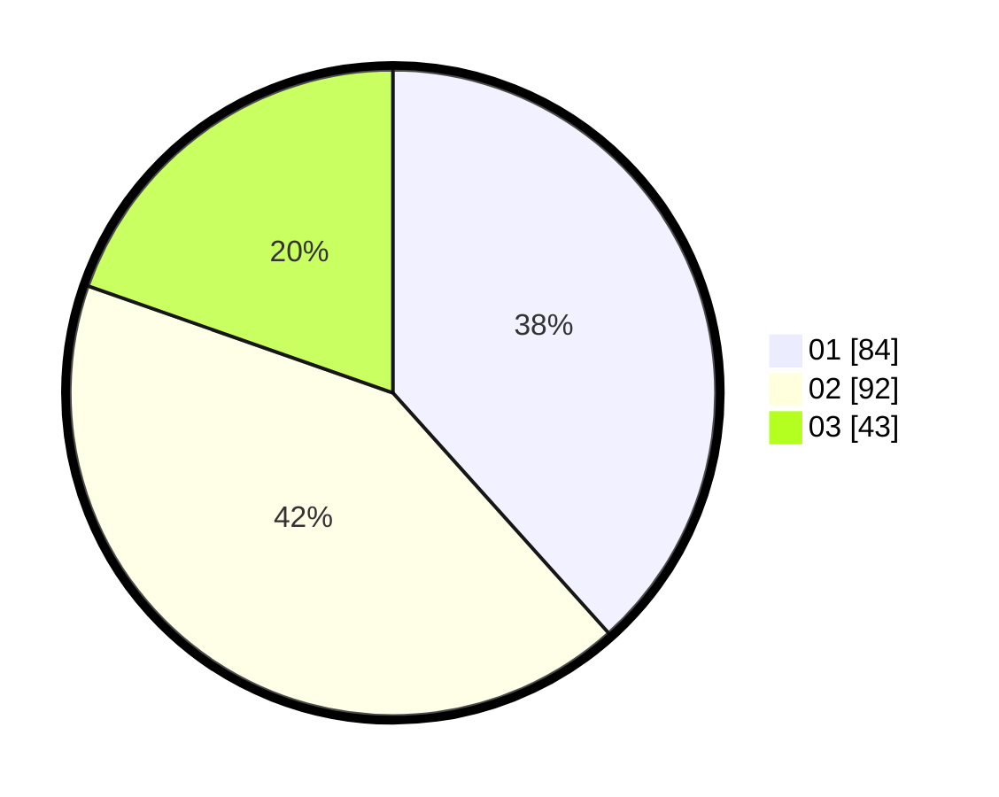

# Hasil

Hasil perolehan suara paslon dapat dilihat pada file paslon-01.txt, paslon-02.txt, dan paslon-03.txt.

Jika tidak ada, artinya data tersebut belum ada pada SIREKAP.

## Perolehan Suara

 * Paslon 01: **84**.
 * Paslon 02: **92**.
 * Paslon 03: **43**.

## Foto C Plano

https://sirekap-obj-formc.kpu.go.id/f7fd/pemilu/ppwp/31/73/05/10/06/3173051006069-20240215-171053--71d81842-7a7b-4576-bc69-aee3cea7b9f2.jpg

https://sirekap-obj-formc.kpu.go.id/f7fd/pemilu/ppwp/31/73/05/10/06/3173051006069-20240215-171054--c387451e-a8c5-42d8-91bb-250dd70364a2.jpg

https://sirekap-obj-formc.kpu.go.id/f7fd/pemilu/ppwp/31/73/05/10/06/3173051006069-20240215-171054--3ae205c6-8b30-42c9-a0a1-47db548d2764.jpg

## DATA PEMILIH TETAP

Jumlah pemilih dalam DPT: **295**.
 * L: **151**.
 * P: **144**.

## DATA PENGGUNA HAK PILIH

Jumlah pengguna hak pilih dalam DPT: **207**.
 * L: **103**.
 * P: **104**.

Jumlah pengguna hak pilih dalam DPTb: **9**.
 * L: **4**.
 * P: **5**.

Jumlah pengguna hak pilih dalam DPK: **4**.
 * L: **2**.
 * P: **2**.

Jumlah pengguna hak pilih: **220**.
 * L: **109**.
 * P: **111**.

## JUMLAH SUARA SAH DAN TIDAK SAH

JUMLAH SELURUH SUARA SAH: **219**.

JUMLAH SUARA TIDAK SAH: **1**.

JUMLAH SELURUH SUARA SAH DAN SUARA TIDAK SAH: **220**.
