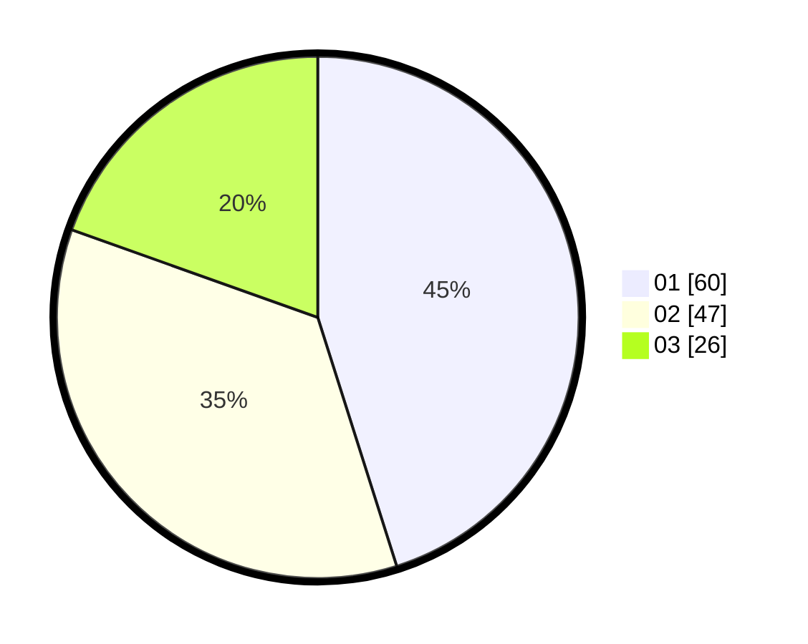

# Hasil

Hasil perolehan suara paslon dapat dilihat pada file paslon-01.txt, paslon-02.txt, dan paslon-03.txt.

Jika tidak ada, artinya data tersebut belum ada pada SIREKAP.

## Perolehan Suara

 * Paslon 01: **60**.
 * Paslon 02: **47**.
 * Paslon 03: **26**.

## Foto C Plano

https://sirekap-obj-formc.kpu.go.id/4732/pemilu/ppwp/31/73/05/10/06/3173051006074-20240215-011325--9f1a6dc1-84fb-4ab4-b6f5-733cc890bb9f.jpg

https://sirekap-obj-formc.kpu.go.id/4732/pemilu/ppwp/31/73/05/10/06/3173051006074-20240215-011427--80da953f-cc19-45f7-b207-8d89034e2e3a.jpg

https://sirekap-obj-formc.kpu.go.id/4732/pemilu/ppwp/31/73/05/10/06/3173051006074-20240215-011536--3f1955f9-161e-47fe-b6c7-058a8a7cdfe2.jpg
