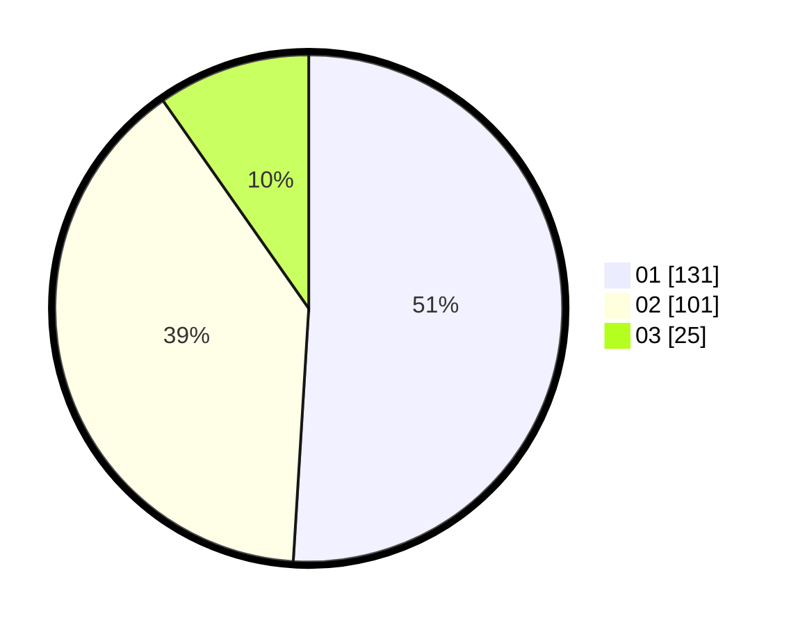

# Hasil

Hasil perolehan suara paslon dapat dilihat pada file paslon-01.txt, paslon-02.txt, dan paslon-03.txt.

Jika tidak ada, artinya data tersebut belum ada pada SIREKAP.

## Perolehan Suara

 * Paslon 01: **131**.
 * Paslon 02: **101**.
 * Paslon 03: **25**.

## Foto C Plano

https://sirekap-obj-formc.kpu.go.id/23c6/pemilu/ppwp/31/73/05/10/06/3173051006077-20240214-235509--54e72bf2-d82b-4a77-8bde-1c6f8cafeca6.jpg

https://sirekap-obj-formc.kpu.go.id/23c6/pemilu/ppwp/31/73/05/10/06/3173051006077-20240214-234810--f9e43d68-5477-4f77-b4e9-c7361896f4ff.jpg

https://sirekap-obj-formc.kpu.go.id/23c6/pemilu/ppwp/31/73/05/10/06/3173051006077-20240214-235735--17d0522b-1208-4224-8fc6-0490041bf80b.jpg
