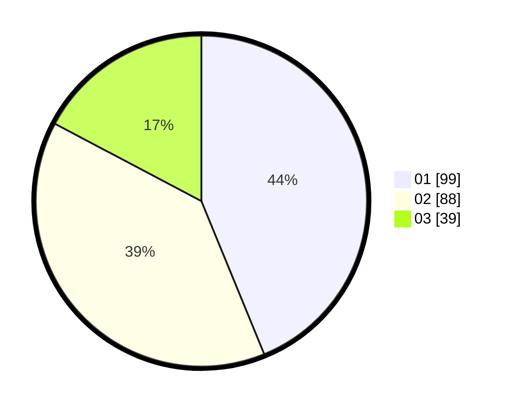

# Hasil

Hasil perolehan suara paslon dapat dilihat pada file paslon-01.txt, paslon-02.txt, dan paslon-03.txt.

Jika tidak ada, artinya data tersebut belum ada pada SIREKAP.

## Perolehan Suara

 * Paslon 01: **99**.
 * Paslon 02: **88**.
 * Paslon 03: **39**.

## Foto C Plano

https://sirekap-obj-formc.kpu.go.id/185b/pemilu/ppwp/31/73/05/10/06/3173051006086-20240216-134438--6fff03fa-48b3-4d48-bea4-c0e4344d8d03.jpg

https://sirekap-obj-formc.kpu.go.id/185b/pemilu/ppwp/31/73/05/10/06/3173051006086-20240216-134440--361f32b3-b5d1-428c-90f4-335edf5aabed.jpg

https://sirekap-obj-formc.kpu.go.id/185b/pemilu/ppwp/31/73/05/10/06/3173051006086-20240216-134439--744df9f7-75c2-4bf3-9117-adc276caa24e.jpg

## DATA PEMILIH TETAP

Jumlah pemilih dalam DPT: **292**.
 * L: **153**.
 * P: **139**.

## DATA PENGGUNA HAK PILIH

Jumlah pengguna hak pilih dalam DPT: **230**.
 * L: **114**.
 * P: **116**.

Jumlah pengguna hak pilih dalam DPTb: **1**.
 * L: **0**.
 * P: **1**.

Jumlah pengguna hak pilih dalam DPK: **0**.
 * L: **0**.
 * P: **0**.

Jumlah pengguna hak pilih: **231**.
 * L: **114**.
 * P: **117**.

## JUMLAH SUARA SAH DAN TIDAK SAH

JUMLAH SELURUH SUARA SAH: **226**.

JUMLAH SUARA TIDAK SAH: **5**.

JUMLAH SELURUH SUARA SAH DAN SUARA TIDAK SAH: **231**.
