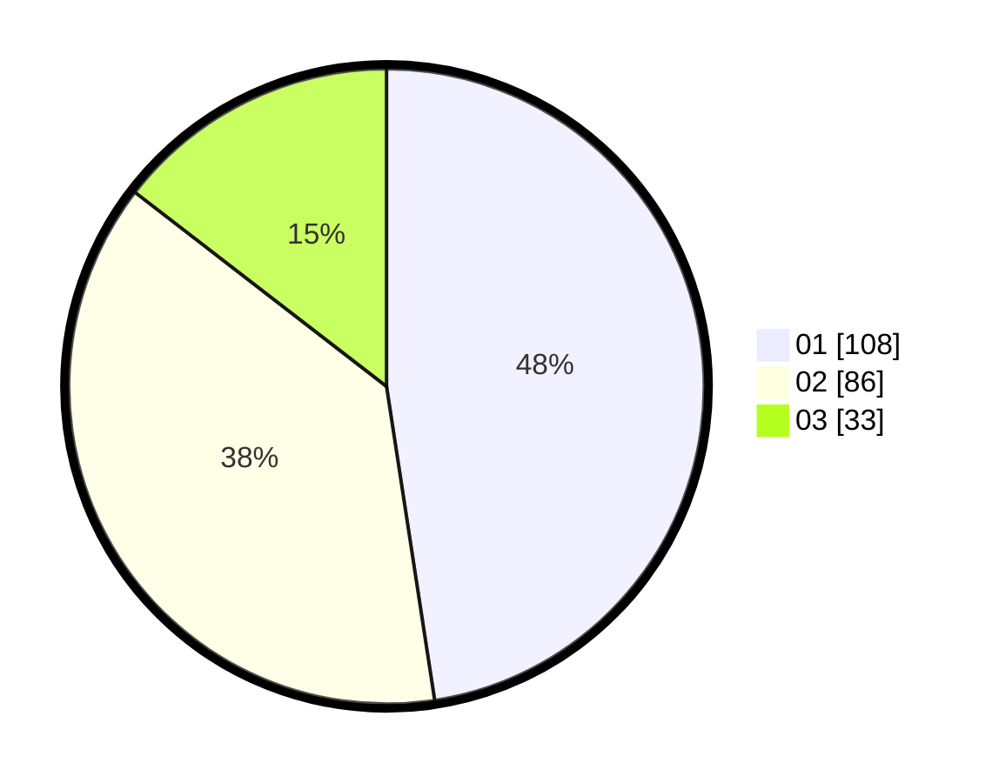

# Hasil

Hasil perolehan suara paslon dapat dilihat pada file paslon-01.txt, paslon-02.txt, dan paslon-03.txt.

Jika tidak ada, artinya data tersebut belum ada pada SIREKAP.

## Perolehan Suara

 * Paslon 01: **108**.
 * Paslon 02: **86**.
 * Paslon 03: **33**.

## Foto C Plano

https://sirekap-obj-formc.kpu.go.id/fdca/pemilu/ppwp/31/73/05/10/06/3173051006087-20240214-155143--ac73f18b-673d-4c6d-b62c-7612a764cf6e.jpg

https://sirekap-obj-formc.kpu.go.id/fdca/pemilu/ppwp/31/73/05/10/06/3173051006087-20240214-160115--cea907be-b45e-4f00-aca9-760d4ee3d50d.jpg

https://sirekap-obj-formc.kpu.go.id/fdca/pemilu/ppwp/31/73/05/10/06/3173051006087-20240214-194127--3710257f-8265-4053-b15e-a811af5a8c40.jpg

## DATA PEMILIH TETAP

Jumlah pemilih dalam DPT: **232**.
 * L: **109**.
 * P: **123**.

## DATA PENGGUNA HAK PILIH

Jumlah pengguna hak pilih dalam DPT: **232**.
 * L: **109**.
 * P: **123**.

Jumlah pengguna hak pilih dalam DPTb: **0**.
 * L: **0**.
 * P: **0**.

Jumlah pengguna hak pilih dalam DPK: **0**.
 * L: **0**.
 * P: **0**.

Jumlah pengguna hak pilih: **232**.
 * L: **109**.
 * P: **123**.

## JUMLAH SUARA SAH DAN TIDAK SAH

JUMLAH SELURUH SUARA SAH: **227**.

JUMLAH SUARA TIDAK SAH: **5**.

JUMLAH SELURUH SUARA SAH DAN SUARA TIDAK SAH: **232**.
