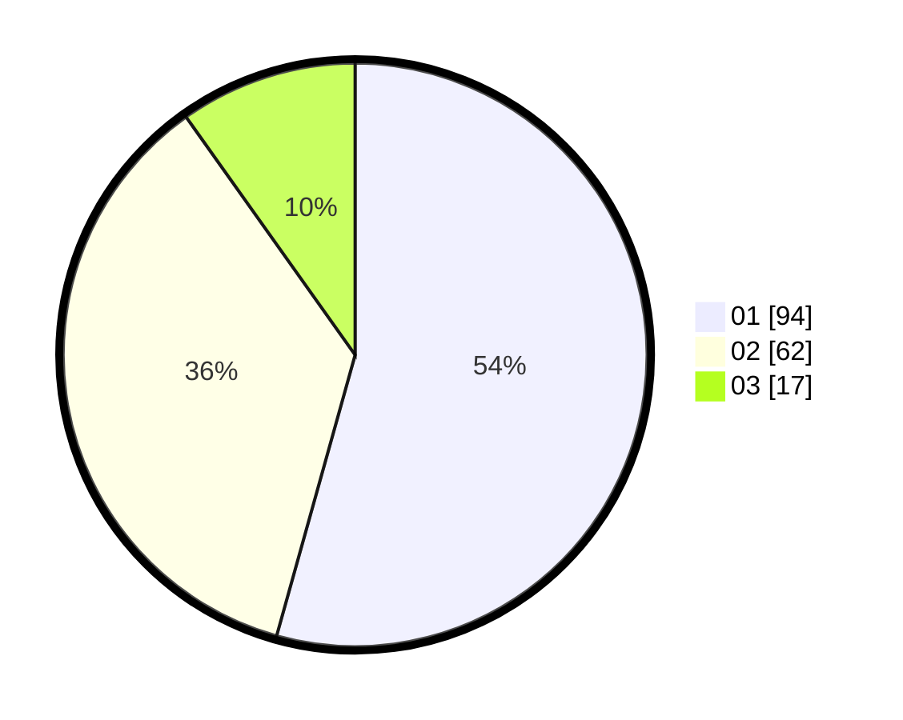

# Hasil

Hasil perolehan suara paslon dapat dilihat pada file paslon-01.txt, paslon-02.txt, dan paslon-03.txt.

Jika tidak ada, artinya data tersebut belum ada pada SIREKAP.

## Perolehan Suara

 * Paslon 01: **94**.
 * Paslon 02: **62**.
 * Paslon 03: **17**.

## Foto C Plano

https://sirekap-obj-formc.kpu.go.id/246a/pemilu/ppwp/31/73/05/10/06/3173051006090-20240218-200237--0afc51b2-9578-4bf9-a531-695beeeec7ae.jpg

https://sirekap-obj-formc.kpu.go.id/246a/pemilu/ppwp/31/73/05/10/06/3173051006090-20240218-200239--cdd05584-91c6-43f3-a961-9f5a9c931910.jpg

https://sirekap-obj-formc.kpu.go.id/246a/pemilu/ppwp/31/73/05/10/06/3173051006090-20240218-200238--562b21e1-669c-43dc-ab2e-5182ee16292f.jpg

## DATA PEMILIH TETAP

Jumlah pemilih dalam DPT: **202**.
 * L: **99**.
 * P: **103**.

## DATA PENGGUNA HAK PILIH

Jumlah pengguna hak pilih dalam DPT: **168**.
 * L: **78**.
 * P: **90**.

Jumlah pengguna hak pilih dalam DPTb: **2**.
 * L: **1**.
 * P: **1**.

Jumlah pengguna hak pilih dalam DPK: **3**.
 * L: **1**.
 * P: **2**.

Jumlah pengguna hak pilih: **173**.
 * L: **80**.
 * P: **93**.

## JUMLAH SUARA SAH DAN TIDAK SAH

JUMLAH SELURUH SUARA SAH: **173**.

JUMLAH SUARA TIDAK SAH: **0**.

JUMLAH SELURUH SUARA SAH DAN SUARA TIDAK SAH: **173**.
