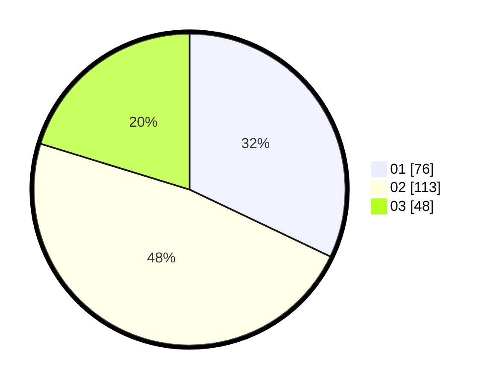

# Hasil

Hasil perolehan suara paslon dapat dilihat pada file paslon-01.txt, paslon-02.txt, dan paslon-03.txt.

Jika tidak ada, artinya data tersebut belum ada pada SIREKAP.

## Perolehan Suara

 * Paslon 01: **76**.
 * Paslon 02: **113**.
 * Paslon 03: **48**.

## Foto C Plano

https://sirekap-obj-formc.kpu.go.id/575c/pemilu/ppwp/31/73/05/10/06/3173051006096-20240214-221312--ce107d2e-a917-4c63-abf3-a8946524b54e.jpg

https://sirekap-obj-formc.kpu.go.id/575c/pemilu/ppwp/31/73/05/10/06/3173051006096-20240214-221432--405c3140-b2ea-44f1-a5ff-ea50c9c587c9.jpg

https://sirekap-obj-formc.kpu.go.id/575c/pemilu/ppwp/31/73/05/10/06/3173051006096-20240214-221654--adf9cba4-a6a6-42fa-a2fb-f4eaff59dc93.jpg
