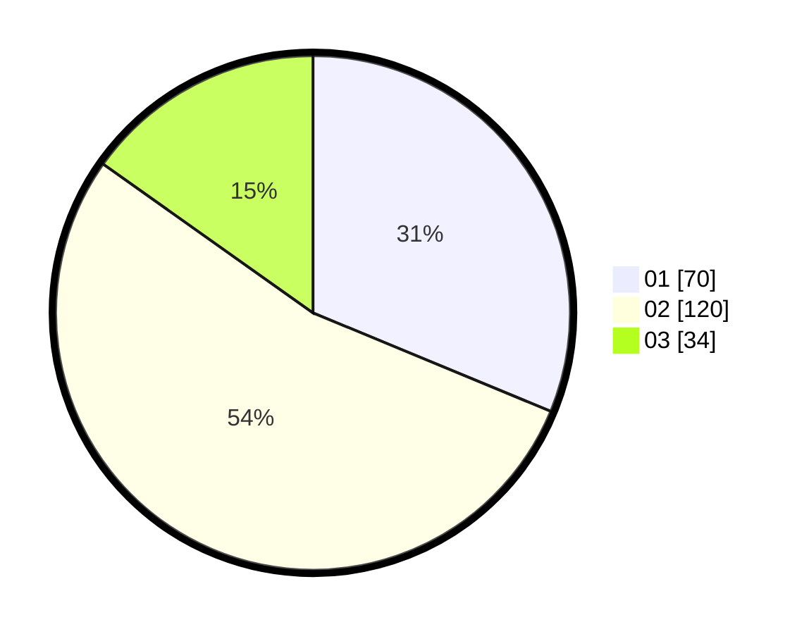

# Hasil

Hasil perolehan suara paslon dapat dilihat pada file paslon-01.txt, paslon-02.txt, dan paslon-03.txt.

Jika tidak ada, artinya data tersebut belum ada pada SIREKAP.

## Perolehan Suara

 * Paslon 01: **70**.
 * Paslon 02: **120**.
 * Paslon 03: **34**.

## Foto C Plano

https://sirekap-obj-formc.kpu.go.id/4cea/pemilu/ppwp/31/73/05/10/06/3173051006099-20240216-151221--cc29ceb5-83eb-4f15-b554-e5290db3d75c.jpg

https://sirekap-obj-formc.kpu.go.id/4cea/pemilu/ppwp/31/73/05/10/06/3173051006099-20240216-151222--bd319c1e-fe06-4063-9647-37f5a79b9f82.jpg

https://sirekap-obj-formc.kpu.go.id/4cea/pemilu/ppwp/31/73/05/10/06/3173051006099-20240216-151221--f1e93770-a1bd-43c1-8469-055b14b0bca2.jpg

## DATA PEMILIH TETAP

Jumlah pemilih dalam DPT: **289**.
 * L: **146**.
 * P: **143**.

## DATA PENGGUNA HAK PILIH

Jumlah pengguna hak pilih dalam DPT: **221**.
 * L: **107**.
 * P: **114**.

Jumlah pengguna hak pilih dalam DPTb: **11**.
 * L: **4**.
 * P: **7**.

Jumlah pengguna hak pilih dalam DPK: **2**.
 * L: **1**.
 * P: **1**.

Jumlah pengguna hak pilih: **234**.
 * L: **112**.
 * P: **122**.

## JUMLAH SUARA SAH DAN TIDAK SAH

JUMLAH SELURUH SUARA SAH: **224**.

JUMLAH SUARA TIDAK SAH: **10**.

JUMLAH SELURUH SUARA SAH DAN SUARA TIDAK SAH: **234**.
