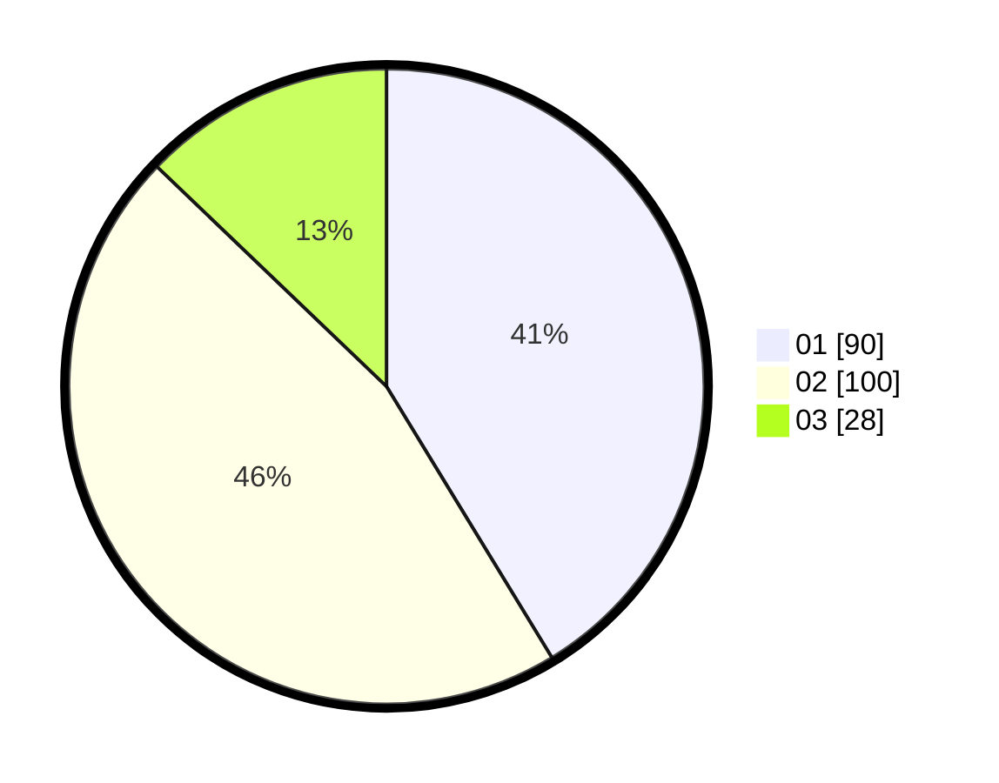

# Hasil

Hasil perolehan suara paslon dapat dilihat pada file paslon-01.txt, paslon-02.txt, dan paslon-03.txt.

Jika tidak ada, artinya data tersebut belum ada pada SIREKAP.

## Perolehan Suara

 * Paslon 01: **90**.
 * Paslon 02: **100**.
 * Paslon 03: **28**.

## Foto C Plano

https://sirekap-obj-formc.kpu.go.id/b50e/pemilu/ppwp/31/73/05/10/06/3173051006100-20240214-211155--e7ee838d-0016-448b-b84c-939c650beec7.jpg

https://sirekap-obj-formc.kpu.go.id/b50e/pemilu/ppwp/31/73/05/10/06/3173051006100-20240214-211419--4cb749a1-b0a7-45cf-9fbf-49697d2e74b2.jpg

https://sirekap-obj-formc.kpu.go.id/b50e/pemilu/ppwp/31/73/05/10/06/3173051006100-20240215-202301--cf727395-3d1d-4bb9-ac6c-45265418d211.jpg
