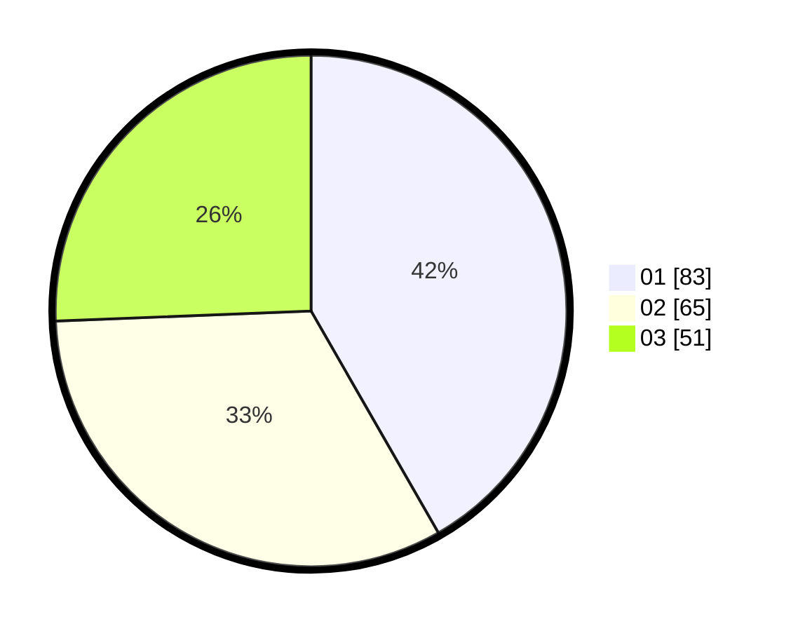

# Hasil

Hasil perolehan suara paslon dapat dilihat pada file paslon-01.txt, paslon-02.txt, dan paslon-03.txt.

Jika tidak ada, artinya data tersebut belum ada pada SIREKAP.

## Perolehan Suara

 * Paslon 01: **83**.
 * Paslon 02: **65**.
 * Paslon 03: **51**.

## Foto C Plano

https://sirekap-obj-formc.kpu.go.id/6d72/pemilu/ppwp/31/73/05/10/06/3173051006101-20240216-144818--a6f367a9-df23-45ff-8ff4-ae6b17dce907.jpg

https://sirekap-obj-formc.kpu.go.id/6d72/pemilu/ppwp/31/73/05/10/06/3173051006101-20240216-144820--f226e5dd-d200-4f70-8483-26bf91b94e2b.jpg

https://sirekap-obj-formc.kpu.go.id/6d72/pemilu/ppwp/31/73/05/10/06/3173051006101-20240216-144819--21c58666-f23a-44e9-be47-c74c761fba1e.jpg

## DATA PEMILIH TETAP

Jumlah pemilih dalam DPT: **260**.
 * L: **132**.
 * P: **128**.

## DATA PENGGUNA HAK PILIH

Jumlah pengguna hak pilih dalam DPT: **199**.
 * L: **100**.
 * P: **99**.

Jumlah pengguna hak pilih dalam DPTb: **0**.
 * L: **0**.
 * P: **0**.

Jumlah pengguna hak pilih dalam DPK: **1**.
 * L: **0**.
 * P: **1**.

Jumlah pengguna hak pilih: **200**.
 * L: **100**.
 * P: **100**.

## JUMLAH SUARA SAH DAN TIDAK SAH

JUMLAH SELURUH SUARA SAH: **199**.

JUMLAH SUARA TIDAK SAH: **1**.

JUMLAH SELURUH SUARA SAH DAN SUARA TIDAK SAH: **200**.
