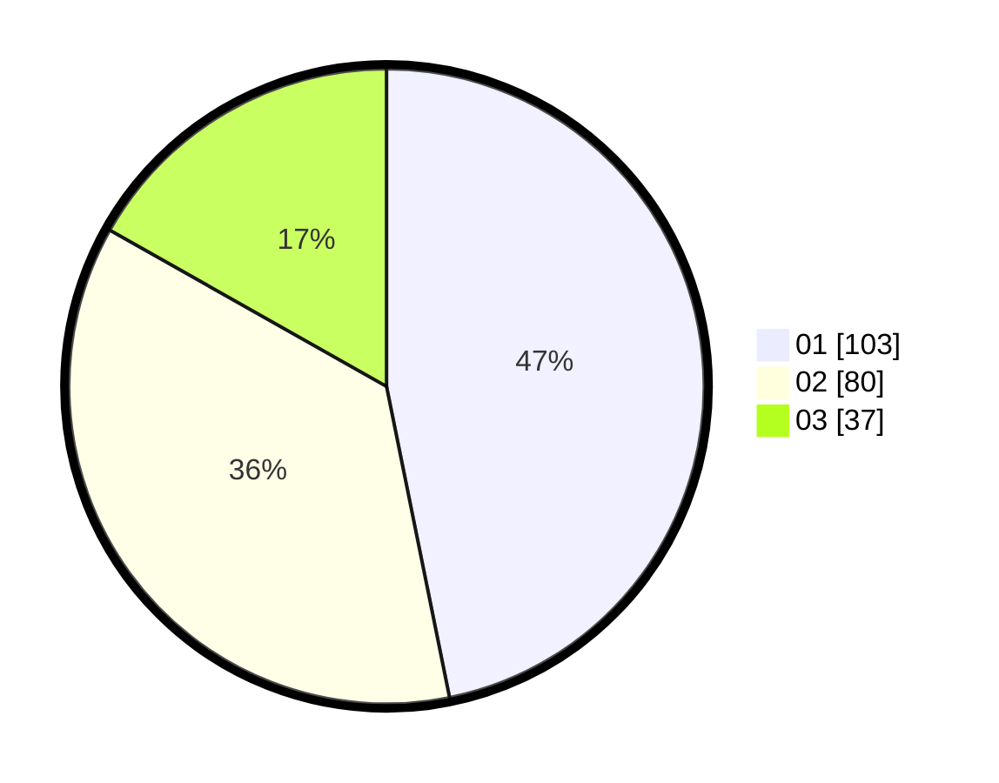

# Hasil

Hasil perolehan suara paslon dapat dilihat pada file paslon-01.txt, paslon-02.txt, dan paslon-03.txt.

Jika tidak ada, artinya data tersebut belum ada pada SIREKAP.

## Perolehan Suara

 * Paslon 01: **103**.
 * Paslon 02: **80**.
 * Paslon 03: **37**.

## Foto C Plano

https://sirekap-obj-formc.kpu.go.id/32f8/pemilu/ppwp/31/73/05/10/06/3173051006102-20240216-195956--3190405c-6c3d-41dc-b582-5e75d5281edb.jpg

https://sirekap-obj-formc.kpu.go.id/32f8/pemilu/ppwp/31/73/05/10/06/3173051006102-20240216-195958--19508676-f338-4647-bc06-db8e5b531adb.jpg

https://sirekap-obj-formc.kpu.go.id/32f8/pemilu/ppwp/31/73/05/10/06/3173051006102-20240216-195957--3fa94028-35d2-4b78-b8b6-a21f869d7fb9.jpg

## DATA PEMILIH TETAP

Jumlah pemilih dalam DPT: **288**.
 * L: **153**.
 * P: **135**.

## DATA PENGGUNA HAK PILIH

Jumlah pengguna hak pilih dalam DPT: **219**.
 * L: **116**.
 * P: **103**.

Jumlah pengguna hak pilih dalam DPTb: **0**.
 * L: **0**.
 * P: **0**.

Jumlah pengguna hak pilih dalam DPK: **2**.
 * L: **0**.
 * P: **2**.

Jumlah pengguna hak pilih: **221**.
 * L: **116**.
 * P: **105**.

## JUMLAH SUARA SAH DAN TIDAK SAH

JUMLAH SELURUH SUARA SAH: **220**.

JUMLAH SUARA TIDAK SAH: **1**.

JUMLAH SELURUH SUARA SAH DAN SUARA TIDAK SAH: **221**.
