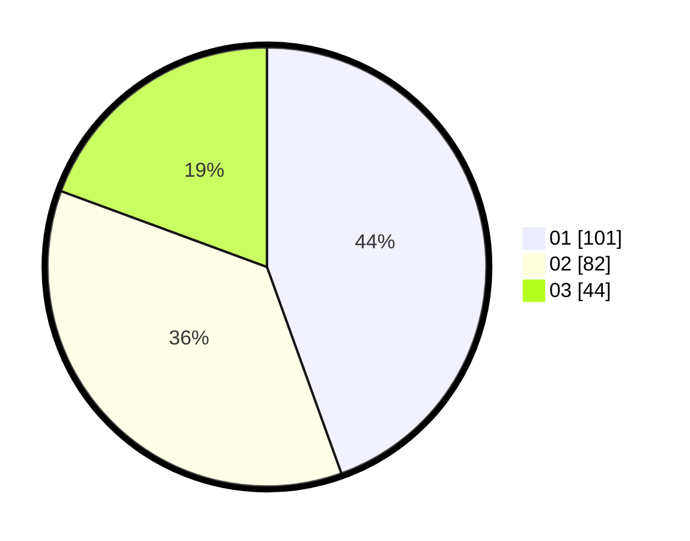

# Hasil

Hasil perolehan suara paslon dapat dilihat pada file paslon-01.txt, paslon-02.txt, dan paslon-03.txt.

Jika tidak ada, artinya data tersebut belum ada pada SIREKAP.

## Perolehan Suara

 * Paslon 01: **101**.
 * Paslon 02: **82**.
 * Paslon 03: **44**.

## Foto C Plano

https://sirekap-obj-formc.kpu.go.id/c8f6/pemilu/ppwp/31/73/05/10/06/3173051006103-20240214-201841--ece0e7e9-4498-4f22-9ef5-cb43dcd1b981.jpg

https://sirekap-obj-formc.kpu.go.id/c8f6/pemilu/ppwp/31/73/05/10/06/3173051006103-20240214-201846--ef8c4f14-f398-41c6-a6eb-df02236c947d.jpg

https://sirekap-obj-formc.kpu.go.id/c8f6/pemilu/ppwp/31/73/05/10/06/3173051006103-20240214-201851--0c160a90-b480-4463-a20f-e12a57f42fcc.jpg

## DATA PEMILIH TETAP

Jumlah pemilih dalam DPT: **283**.
 * L: **143**.
 * P: **140**.

## DATA PENGGUNA HAK PILIH

Jumlah pengguna hak pilih dalam DPT: **217**.
 * L: **106**.
 * P: **111**.

Jumlah pengguna hak pilih dalam DPTb: **6**.
 * L: **2**.
 * P: **4**.

Jumlah pengguna hak pilih dalam DPK: **5**.
 * L: **2**.
 * P: **3**.

Jumlah pengguna hak pilih: **228**.
 * L: **110**.
 * P: **118**.

## JUMLAH SUARA SAH DAN TIDAK SAH

JUMLAH SELURUH SUARA SAH: **227**.

JUMLAH SUARA TIDAK SAH: **1**.

JUMLAH SELURUH SUARA SAH DAN SUARA TIDAK SAH: **228**.
