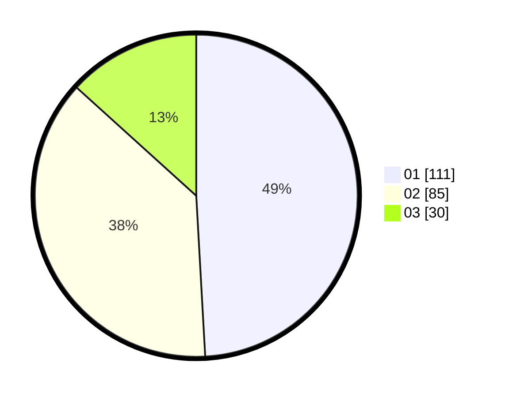

# Hasil

Hasil perolehan suara paslon dapat dilihat pada file paslon-01.txt, paslon-02.txt, dan paslon-03.txt.

Jika tidak ada, artinya data tersebut belum ada pada SIREKAP.

## Perolehan Suara

 * Paslon 01: **111**.
 * Paslon 02: **85**.
 * Paslon 03: **30**.

## Foto C Plano

https://sirekap-obj-formc.kpu.go.id/f4a1/pemilu/ppwp/31/73/05/10/06/3173051006106-20240216-014107--0b20758e-473b-450d-b39f-d772f63b19dd.jpg

https://sirekap-obj-formc.kpu.go.id/f4a1/pemilu/ppwp/31/73/05/10/06/3173051006106-20240216-015253--4913fedd-9b8c-4b09-bf02-5e51042a215d.jpg

https://sirekap-obj-formc.kpu.go.id/f4a1/pemilu/ppwp/31/73/05/10/06/3173051006106-20240216-014108--808276d9-7e25-4e74-aaa9-1c169337869a.jpg

## DATA PEMILIH TETAP

Jumlah pemilih dalam DPT: **230**.
 * L: **110**.
 * P: **120**.

## DATA PENGGUNA HAK PILIH

Jumlah pengguna hak pilih dalam DPT: **230**.
 * L: **110**.
 * P: **120**.

Jumlah pengguna hak pilih dalam DPTb: **0**.
 * L: **0**.
 * P: **0**.

Jumlah pengguna hak pilih dalam DPK: **0**.
 * L: **0**.
 * P: **0**.

Jumlah pengguna hak pilih: **230**.
 * L: **110**.
 * P: **120**.

## JUMLAH SUARA SAH DAN TIDAK SAH

JUMLAH SELURUH SUARA SAH: **226**.

JUMLAH SUARA TIDAK SAH: **4**.

JUMLAH SELURUH SUARA SAH DAN SUARA TIDAK SAH: **230**.
