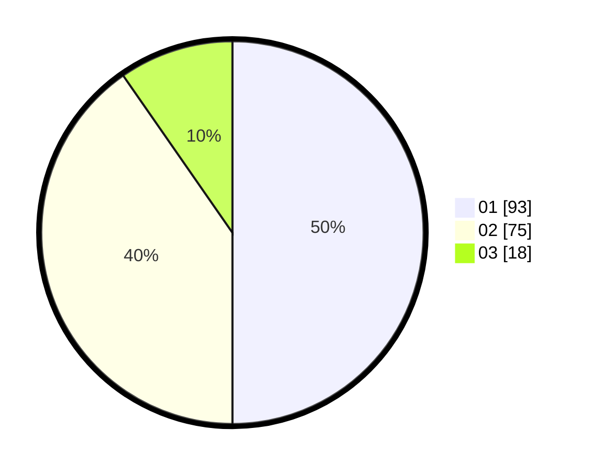

# Hasil

Hasil perolehan suara paslon dapat dilihat pada file paslon-01.txt, paslon-02.txt, dan paslon-03.txt.

Jika tidak ada, artinya data tersebut belum ada pada SIREKAP.

## Perolehan Suara

 * Paslon 01: **93**.
 * Paslon 02: **75**.
 * Paslon 03: **18**.

## Foto C Plano

https://sirekap-obj-formc.kpu.go.id/eb26/pemilu/ppwp/31/73/05/10/06/3173051006107-20240216-081522--51d79651-027d-4be3-bcb8-9bebf7cb0e86.jpg

https://sirekap-obj-formc.kpu.go.id/eb26/pemilu/ppwp/31/73/05/10/06/3173051006107-20240216-081541--5c6d5f53-5c44-41fa-a53a-86db33127170.jpg

https://sirekap-obj-formc.kpu.go.id/eb26/pemilu/ppwp/31/73/05/10/06/3173051006107-20240216-081533--3b064ff3-0ddb-438d-a2e8-9135a9c3cbc5.jpg

## DATA PEMILIH TETAP

Jumlah pemilih dalam DPT: **244**.
 * L: **126**.
 * P: **118**.

## DATA PENGGUNA HAK PILIH

Jumlah pengguna hak pilih dalam DPT: **189**.
 * L: **93**.
 * P: **96**.

Jumlah pengguna hak pilih dalam DPTb: **0**.
 * L: **0**.
 * P: **0**.

Jumlah pengguna hak pilih dalam DPK: **0**.
 * L: **0**.
 * P: **0**.

Jumlah pengguna hak pilih: **189**.
 * L: **93**.
 * P: **96**.

## JUMLAH SUARA SAH DAN TIDAK SAH

JUMLAH SELURUH SUARA SAH: **186**.

JUMLAH SUARA TIDAK SAH: **3**.

JUMLAH SELURUH SUARA SAH DAN SUARA TIDAK SAH: **189**.
