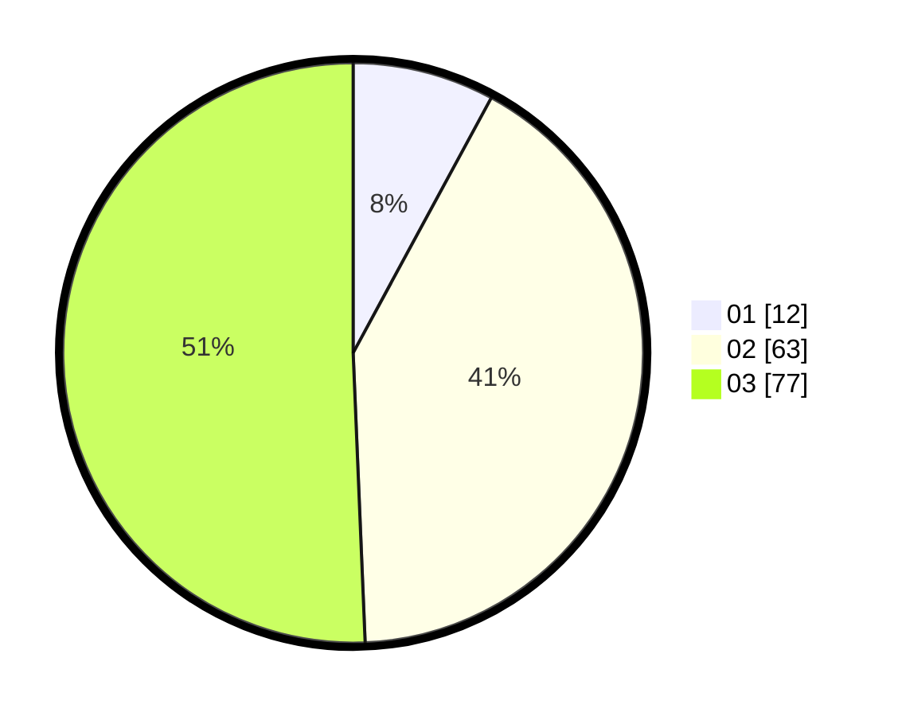

# Hasil

Hasil perolehan suara paslon dapat dilihat pada file paslon-01.txt, paslon-02.txt, dan paslon-03.txt.

Jika tidak ada, artinya data tersebut belum ada pada SIREKAP.

## Perolehan Suara

 * Paslon 01: **12**.
 * Paslon 02: **63**.
 * Paslon 03: **77**.

## Foto C Plano

https://sirekap-obj-formc.kpu.go.id/ff96/pemilu/ppwp/31/73/05/10/06/3173051006110-20240215-020415--d27ee896-93f8-4415-af90-71a459e19077.jpg

https://sirekap-obj-formc.kpu.go.id/ff96/pemilu/ppwp/31/73/05/10/06/3173051006110-20240215-020439--68de8f33-a4e4-4dea-9833-0960804c0bcc.jpg

https://sirekap-obj-formc.kpu.go.id/ff96/pemilu/ppwp/31/73/05/10/06/3173051006110-20240215-020426--c38a7789-abfe-4375-b107-867992a6967e.jpg

## DATA PEMILIH TETAP

Jumlah pemilih dalam DPT: **173**.
 * L: **75**.
 * P: **98**.

## DATA PENGGUNA HAK PILIH

Jumlah pengguna hak pilih dalam DPT: **141**.
 * L: **61**.
 * P: **80**.

Jumlah pengguna hak pilih dalam DPTb: **12**.
 * L: **3**.
 * P: **9**.

Jumlah pengguna hak pilih dalam DPK: **1**.
 * L: **0**.
 * P: **1**.

Jumlah pengguna hak pilih: **154**.
 * L: **64**.
 * P: **90**.

## JUMLAH SUARA SAH DAN TIDAK SAH

JUMLAH SELURUH SUARA SAH: **152**.

JUMLAH SUARA TIDAK SAH: **2**.

JUMLAH SELURUH SUARA SAH DAN SUARA TIDAK SAH: **154**.
