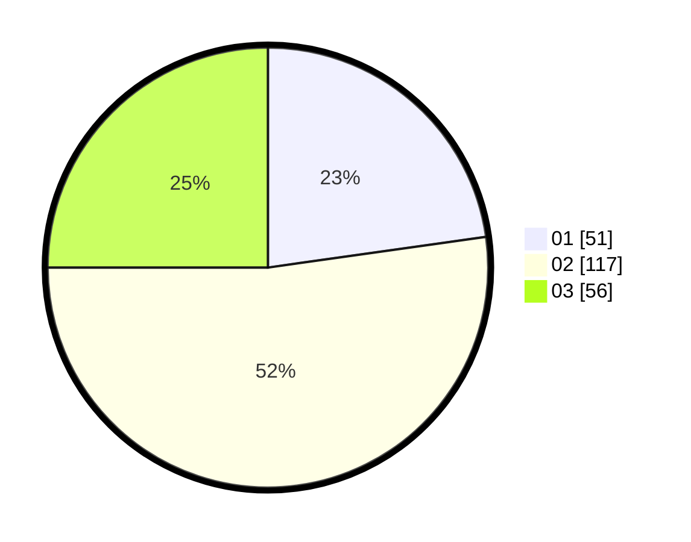

# Hasil

Hasil perolehan suara paslon dapat dilihat pada file paslon-01.txt, paslon-02.txt, dan paslon-03.txt.

Jika tidak ada, artinya data tersebut belum ada pada SIREKAP.

## Perolehan Suara

 * Paslon 01: **51**.
 * Paslon 02: **117**.
 * Paslon 03: **56**.

## Foto C Plano

https://sirekap-obj-formc.kpu.go.id/357a/pemilu/ppwp/31/73/05/10/06/3173051006113-20240214-230918--f2c70ab4-fefb-48dc-8c0c-f1f077523aa8.jpg

https://sirekap-obj-formc.kpu.go.id/357a/pemilu/ppwp/31/73/05/10/06/3173051006113-20240214-231020--27e6be57-d7a4-477b-9866-2761ab322bb1.jpg

https://sirekap-obj-formc.kpu.go.id/357a/pemilu/ppwp/31/73/05/10/06/3173051006113-20240214-235154--6848b43c-fb17-4ec2-8d56-22a668e1a1cf.jpg
