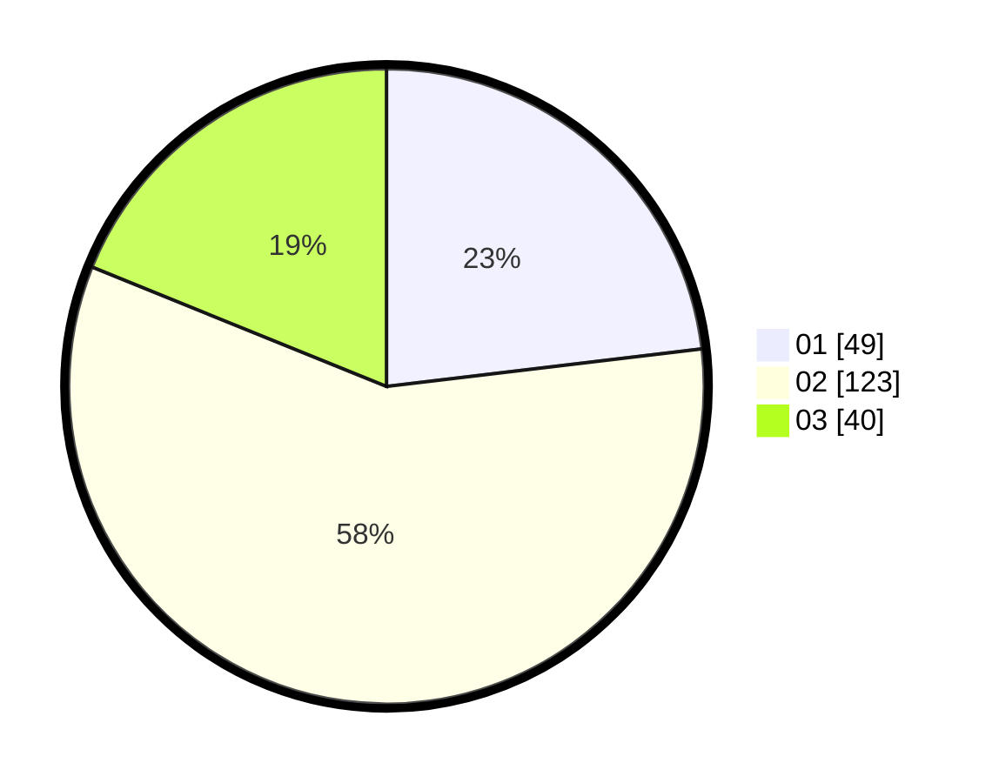

# Hasil

Hasil perolehan suara paslon dapat dilihat pada file paslon-01.txt, paslon-02.txt, dan paslon-03.txt.

Jika tidak ada, artinya data tersebut belum ada pada SIREKAP.

## Perolehan Suara

 * Paslon 01: **49**.
 * Paslon 02: **123**.
 * Paslon 03: **40**.

## Foto C Plano

https://sirekap-obj-formc.kpu.go.id/bb08/pemilu/ppwp/31/73/05/10/06/3173051006117-20240215-004507--90682222-2798-42fb-94bb-82ad29ccc88e.jpg

https://sirekap-obj-formc.kpu.go.id/bb08/pemilu/ppwp/31/73/05/10/06/3173051006117-20240215-004512--88b53628-ba4e-4f36-8c64-87a7c9cd2db1.jpg

https://sirekap-obj-formc.kpu.go.id/bb08/pemilu/ppwp/31/73/05/10/06/3173051006117-20240215-004517--291b6fda-0207-4a99-8c7b-a7c31ad11d7c.jpg

## DATA PEMILIH TETAP

Jumlah pemilih dalam DPT: **287**.
 * L: **144**.
 * P: **143**.

## DATA PENGGUNA HAK PILIH

Jumlah pengguna hak pilih dalam DPT: **216**.
 * L: **100**.
 * P: **116**.

Jumlah pengguna hak pilih dalam DPTb: **0**.
 * L: **0**.
 * P: **0**.

Jumlah pengguna hak pilih dalam DPK: **0**.
 * L: **0**.
 * P: **0**.

Jumlah pengguna hak pilih: **216**.
 * L: **100**.
 * P: **116**.

## JUMLAH SUARA SAH DAN TIDAK SAH

JUMLAH SELURUH SUARA SAH: **212**.

JUMLAH SUARA TIDAK SAH: **4**.

JUMLAH SELURUH SUARA SAH DAN SUARA TIDAK SAH: **216**.
