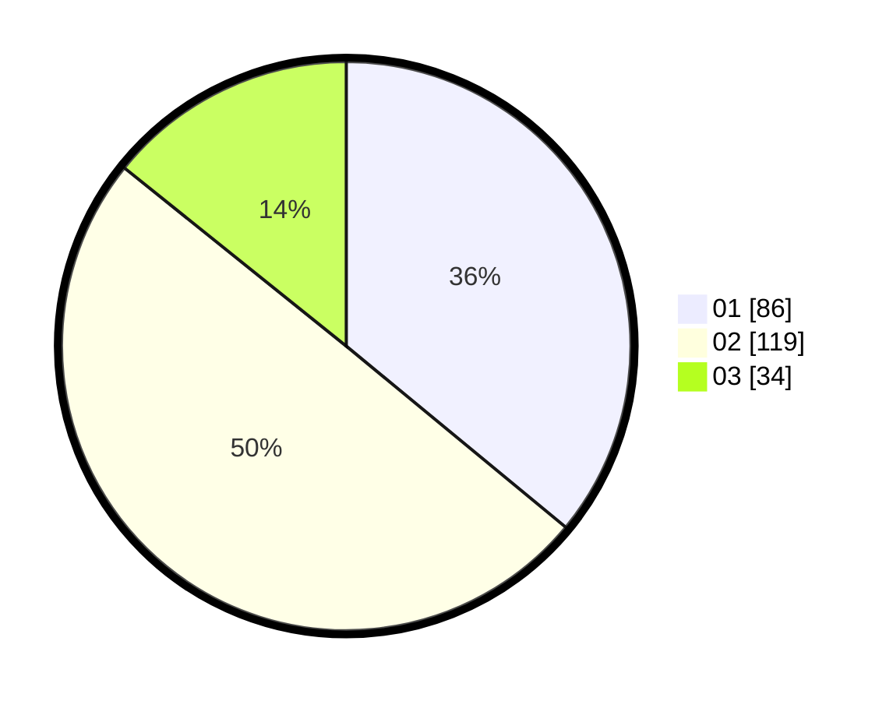

# Hasil

Hasil perolehan suara paslon dapat dilihat pada file paslon-01.txt, paslon-02.txt, dan paslon-03.txt.

Jika tidak ada, artinya data tersebut belum ada pada SIREKAP.

## Perolehan Suara

 * Paslon 01: **86**.
 * Paslon 02: **119**.
 * Paslon 03: **34**.

## Foto C Plano

https://sirekap-obj-formc.kpu.go.id/77b6/pemilu/ppwp/31/73/05/10/06/3173051006119-20240216-044841--1dd83ec0-f8a9-4a0b-b654-4efcd1eb0c3e.jpg

https://sirekap-obj-formc.kpu.go.id/77b6/pemilu/ppwp/31/73/05/10/06/3173051006119-20240214-155316--6c6fb2ad-ef38-44ce-af0d-973bc5d5d3b6.jpg

https://sirekap-obj-formc.kpu.go.id/77b6/pemilu/ppwp/31/73/05/10/06/3173051006119-20240214-155226--26cf27e0-7487-4968-af60-ce5408feb00e.jpg

## DATA PEMILIH TETAP

Jumlah pemilih dalam DPT: **291**.
 * L: **148**.
 * P: **143**.

## DATA PENGGUNA HAK PILIH

Jumlah pengguna hak pilih dalam DPT: **235**.
 * L: **111**.
 * P: **124**.

Jumlah pengguna hak pilih dalam DPTb: **3**.
 * L: **1**.
 * P: **2**.

Jumlah pengguna hak pilih dalam DPK: **4**.
 * L: **2**.
 * P: **2**.

Jumlah pengguna hak pilih: **242**.
 * L: **114**.
 * P: **128**.

## JUMLAH SUARA SAH DAN TIDAK SAH

JUMLAH SELURUH SUARA SAH: **239**.

JUMLAH SUARA TIDAK SAH: **3**.

JUMLAH SELURUH SUARA SAH DAN SUARA TIDAK SAH: **242**.
