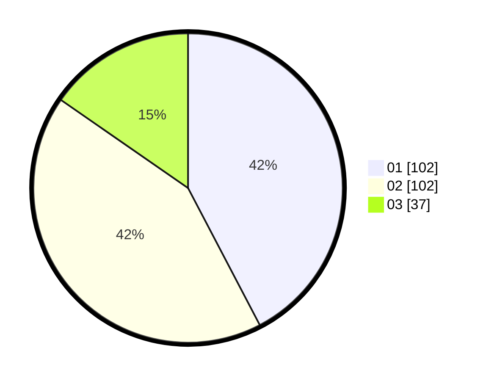

# Hasil

Hasil perolehan suara paslon dapat dilihat pada file paslon-01.txt, paslon-02.txt, dan paslon-03.txt.

Jika tidak ada, artinya data tersebut belum ada pada SIREKAP.

## Perolehan Suara

 * Paslon 01: **102**.
 * Paslon 02: **102**.
 * Paslon 03: **37**.

## Foto C Plano

https://sirekap-obj-formc.kpu.go.id/6891/pemilu/ppwp/31/73/05/10/06/3173051006120-20240215-035811--bc5c7d90-3665-42fe-8913-c0002bb6513c.jpg

https://sirekap-obj-formc.kpu.go.id/6891/pemilu/ppwp/31/73/05/10/06/3173051006120-20240215-035942--f2b8b703-730d-46f0-bfcc-6abe370d3fed.jpg

https://sirekap-obj-formc.kpu.go.id/6891/pemilu/ppwp/31/73/05/10/06/3173051006120-20240215-040010--0fb9ec55-0b68-40cd-adc0-b050364a294a.jpg

## DATA PEMILIH TETAP

Jumlah pemilih dalam DPT: **286**.
 * L: **141**.
 * P: **145**.

## DATA PENGGUNA HAK PILIH

Jumlah pengguna hak pilih dalam DPT: **242**.
 * L: **120**.
 * P: **122**.

Jumlah pengguna hak pilih dalam DPTb: **0**.
 * L: **0**.
 * P: **0**.

Jumlah pengguna hak pilih dalam DPK: **0**.
 * L: **0**.
 * P: **0**.

Jumlah pengguna hak pilih: **242**.
 * L: **120**.
 * P: **122**.

## JUMLAH SUARA SAH DAN TIDAK SAH

JUMLAH SELURUH SUARA SAH: **241**.

JUMLAH SUARA TIDAK SAH: **1**.

JUMLAH SELURUH SUARA SAH DAN SUARA TIDAK SAH: **242**.
