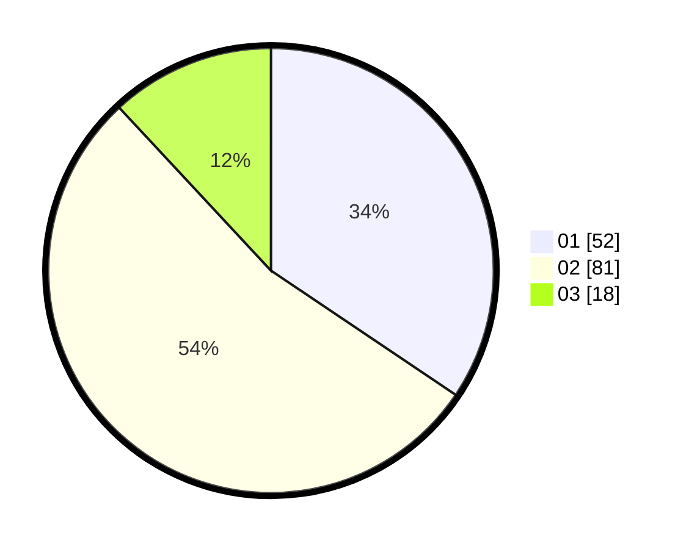

# Hasil

Hasil perolehan suara paslon dapat dilihat pada file paslon-01.txt, paslon-02.txt, dan paslon-03.txt.

Jika tidak ada, artinya data tersebut belum ada pada SIREKAP.

## Perolehan Suara

 * Paslon 01: **52**.
 * Paslon 02: **81**.
 * Paslon 03: **18**.

## Foto C Plano

https://sirekap-obj-formc.kpu.go.id/2ee2/pemilu/ppwp/31/73/05/10/06/3173051006123-20240216-191144--e7112b51-4fce-4a65-b8a6-4f6fb5861650.jpg

https://sirekap-obj-formc.kpu.go.id/2ee2/pemilu/ppwp/31/73/05/10/06/3173051006123-20240216-193611--4e7a243b-0735-4d7d-a5e5-9253df568eda.jpg
